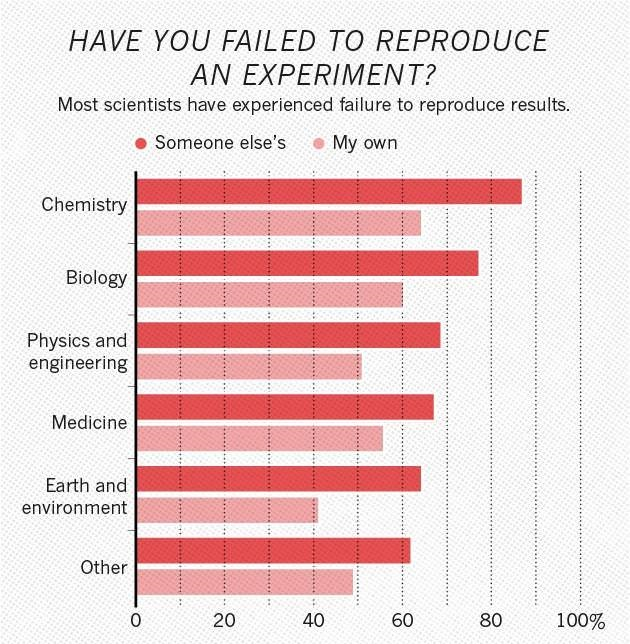
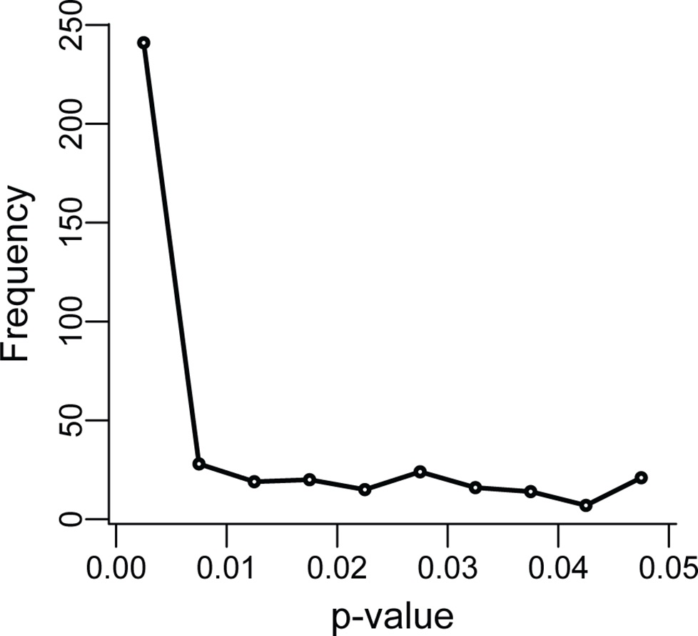
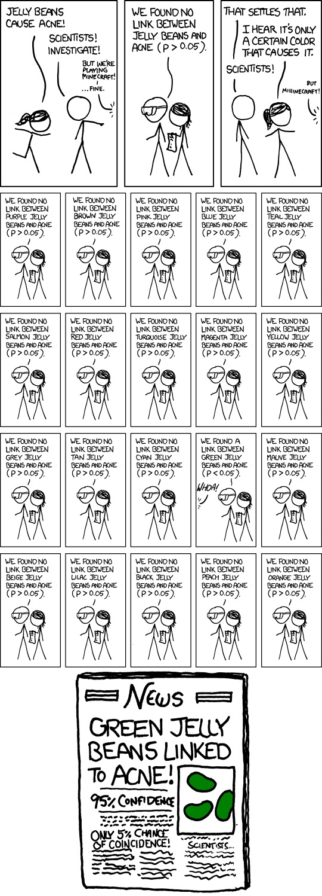
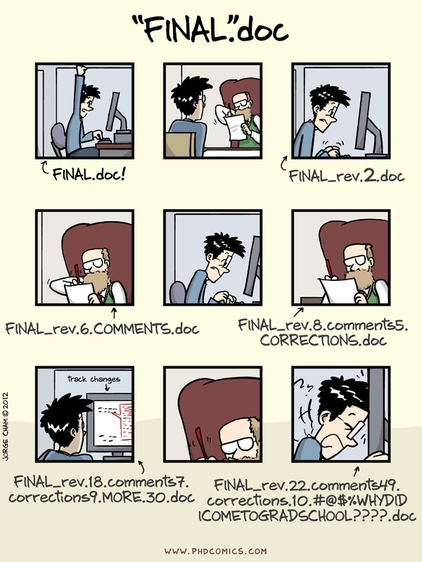

---
# Please do not edit this file directly; it is auto generated.
# Instead, please edit 01-core-concepts.md in _episodes_rmd/
title: "Core concepts in reproducibility"
author: "Rob Arbon, Natalie Thurlby"
date: "05/11/2019"
output: html_document
teaching: 45
exercises: 25
questions:
- "What is the reproducibility crisis?"
- "What are the key problems for reproducible research?"
- "How can we solve these key problems in our research?"
objectives:
- "Have an overview of issues surrounding the reproducibility crisis and current ways to avoid those pitfalls."
- "Be aware of the tools and practices that are used in your area of research and how they may contribute to the reproducibility crisis."
keypoints:
- "We can't assume that published research would have the same result if someone else performed it, but there are ways of increasing trust in research."
- "Make your data and analysis Finable, Accessible, Interoperable and Reusable"
- "Use simulations to test unintuitive statistics."
- "Get in touch with statisticians, or software engineers if you need support. Use ask-JGI, ask-RSE, and the statistics clinic."
source: Rmd
---

<!-- Core concepts in reproducibility. This will cover basic elements that go wrong in common research practices (and that the skills covered in this workshop will help ameliorate), e.g. p-hacking, HARKing, FAIR principles, publication bias, power etc., and how they lead to bad science. Participants will identify and discuss how these issues affect their own research areas. -->


## Motivation

It's important that we can trust the results of research because we rely on those results to inform us. We make policies and laws, and choose which avenues of our own research to explore. If research is untrustworthy, that could result in anything from wasting time and money, causing a PhD student distress, or even cost lives (for example, in the case of basing policy or choice of drug perscribed on research).

Aside from the important benefits for society, we also want others to trust our research as it's connected to our reputation, and our success in our future careers.

## What is reproducibility?

The most basic definition of reproducibilty is: a research result is reproducible if you can get the __same result__ when you do the research again. Sometimes it's useful to go one step further and distinguish between different types of reproducible research.

The matrix below (from [The Turing Way](https://the-turing-way.netlify.com/)) gives a useful set of definitions:

* Results are __reproducible__ if we get the same result when we do the research again using the same analysis, on the same data.
* Results are __replicable__ if we get the same result when we do the research again using the same analysis, on different (newly collected) data.
* Results are __robust__ if we get the same result when we do the research again using different analysis, on the same data.
* Results are __generalisable__ if we get the same result when we do the research again using a different analysis, on different (newly collected) data.

### What do we mean by the same result?

Scientific results are commonly reported with numbers to help resarchers understand their importance. Two of these measures are p-values and effect size and much of the discussion around reproducible, replicable, and robust research centres around these two measurements. These numbers of an original study and a reproduction don't have to be exactly the same to be considered to have successfully reproduced.

> ## Reminder:
> * __Effect Sizes__ measure the strength of a relationship between two variables. There are different types of effect size, for example Cohen's D or the Pearson corellation coefficient.
> * __P-values__ measure the probability of getting as convincing a result by chance assuming that there is no effect - they range between 0 and 1. The commonly used threshold for a "statistically significant" result is p < 0.05.
{: .callout}

>##Discussion
> In pairs discuss the following.
>
> How often do you think:
> 1. research in your area would be reproducible, if you had access to the exact data and analyses?
> 2. research in your area would be replicable, if you had access to the exact data and analyses?
> 3. research in your area provides access to the exact data and analyses?
{: discussion}

## The reproducibility crisis

The reproducibility crisis is a recent event in science, where scientific results were found to replicate much less than scientists had assumed or hoped that they would.

__Less than 40% of replications of well-known Psychology studies were found to reproduce__ (have significant results):

P-values in the original studies were constrained between 0 and just above 0.05, but in the replications, p-values ranged from 0 to 1 (with less than 40% being less than 0.05). Effect sizes were noticably lower, too.

Similar results were found in Cancer Biology (where only 11% of results replicated).
Begley, C. Glenn, and Lee M. Ellis. "Drug development: Raise standards for preclinical cancer research." Nature 483.7391 (2012): 531.

Not only that, but most researchers agree that there is a problem, and most have failed to reproduce a result.



Of the 1576 scientists surveyed, __over 70% of scientists surveyed have experienced failure to reproduce other's results__ and __over 50% have failed to reproduce their own results__.

## Why did it take us so long to notice?
### Un"FAIR" data and analyses
It used to be harder to share and access data and analyses. FAIR principles describe how data/analyses need to be stored in order for them to be used by others:

- Findable: People need to know the data exists (e.g. link to in your paper)
- Accessible: Data needs to be available in a format that humans and computers can understand (e.g. downloadable on the internet)
- Interoperable: The data needs to be in a format that people usually use.
- Reusable: Data must be clearly licensed so people know if they're allowed to reuse them.

If data is messy, unlabelled, or doesn't exist no one can check if the result is correct. 

## Why is it happening?
### Data storage mistakes
* High-profile studies have been shown to be wrong because of problems like accidentally deleting columns of excel files, or rewriting important values.

### Data analysis mistakes
* When data analysis is carried out by clicking on buttons in a certain order (using a Graphical User Interface or GUI), they can accidentally be clicked in the wrong order and give incorrect results. 
* People's code doesn't always do what they think it does.

### P-hacking
P-hacking is a catch-all term for making p-values appear smaller than they are. It includes practices like:
- Collecting samples until your sample size gives you p < 0.05
- Choosing different statistical tests until you get p<0.05
- Running lots of statistical tests and not correcting for mulitple hypotheses

P-curves show evidence that this is occuring in research, particularly when p-values are close to 0.05.


> ## The Garden of Forking Paths
> The garden of forking paths is a metaphor for testing multiple hypotheses. At each time we make a decision in our analysis, the path splits. There are many different paths that we could go down and answers that we could reach from our inital hypothesis.
>
{: .callout}

## What are the chances?
By going through a simulation in R, we can test our intuition around doing multiple tests.

```r
n_reps = 100000
n_tests = 1
significance_cutoff = 0.05

total_wins = 0
for(i in 1:n_reps){
if( sum(runif(n_tests,0,1) < significance_cutoff) ){
  total_wins = total_wins + 1
}
}
print(total_wins/n_reps)
```

```
## [1] 0.05014
```

> ## Challenge 1
> What happens when you change the number of tests?
> What numer of tests do you need to do to get a better than 50/50 chance of getting a "significant" result?
> > ## Solution
> > 
> > ```r
> > n_tests = 14
> > ```
> {: .solution}
{: .challenge}

### HARKing = Hypothesising After Results are Known
Instead of trying the same hypothesis with 20 different methodologies, you can get the same effect (finding erroneous "significant" results) by testing 20 different hypotheses and decide what you hypothesised afterwards.


### Publication Bias
There is bias in what is published because we're naturally more interested in positive results.
This bias rewards researchers for p-hacking (incentivising them to do so), and also wastes time since researchers will repeat experiments with negative results.

While publication bias is one reason for P-hacking and HARKing, there is a more convincing reason why it continues to happen. It's not always intuitive how damaging extra tests can be. Researchers may think they've triedless models than they think, and we just really want to find out "the truth", so it's easy to say "just one more". 
* Be careful of doing too many statistical tests (it's easy to accidentally p-hack)
* If you're ever unsure about if what you're doing is right, consult a statistician.
* If you need convincing, simulations are very convincing.

> ## Discussion: Barriers to reproducibility in your field.
> We've mentioned some barriers to reproducibility so far. In small groups, first write down  the issues you remember on the paper in front of you in one colour.
>Then discuss how you think these reproducibility problems mentioned might affect your fields. 
>__(10 minutes total)__
{: .discussion}

### Make data available
By making your data available, you can ensure that you and others will be able to replicate your work. This can involve:
- Making your original data freely available
- Storing your original data in a secure place (e.g. [data.bris](https://data.bris.ac.uk/data/) using the Data Access Committee), and only sharing it with people who meet ethical research standards.
- You can make anonymised or aggregated data available.
- You can synthesise data which is similar to your original data, but does not contain any real subjects, and make that available.

Whatever you make available, it must be well labelled and described if it's going to be useful for future you, or for others.


### Make analysis available
__Scripts__ make analysis available by writing scripts, they:
- Describe exactly what your analysis is and can be shared with others
- Can be written in any programming language (e.g R, Python)
- Always perform in the same order and get the same result
- Those written in non-proprietry software (e.g. R and python, rather than SPSS/Stata) are more accessible.

__Literate programming__ = scripts + describing what's happening

Ways to do it:
- Comments
- Documentation
- README files
- Notebooks (e.g. RMarkdown, Jupyter)

Much of the time this is carried out in markdown. Markdown is a way of turning simple formatting into html (to be shared on the web). It's the language of RMarkdown and GitHub.

### Version Control

* You will want different versions of your scripts/notebooks.
* Nothing is worse than knowing your program worked earlier, but that it doesn't now.
* Having files named `analysis_ver32_final_actually_final.R` is not fun and it's easy to make mistakes.
* When you come back to your work later, you won't be able to remember which is the `for_realsies_final_file.txt`

Version control is a system for avoiding these problems.



### Pre-registration
*The first principle is you must not fool yourself — and you are the easiest person to fool* - Richard Feynman


Pre-registering your analyis is saying what analysis you are going to do in advance, including:
* which variables you are going to look at
* what sample size you will aim for
* what you will exclude from your sample
* what variables you are going to correct for

__Pre-registration is only for analyses where you are seeking to confirm a hypothesis__

### [Registered reports](https://cos.io/rr/)

Registered reports are a new model for publishing papers. Instead of applying to journals once you have your results, you apply while after you have made plans for research and analysis, but before you have collected your data.

Extra great for research(ers) because:
* You can publish non-significant results 
* We will all be able to benefit from knowing what __doesn't__ work.


## Draw a "concept map" about reproducibility

> ## Concept map activity
> 1. Create concept maps in small groups  (10 minutes)
> 2. Feed back to the group 
>
> We already have some of the barriers to reproducibility written down (e.g. publication bias, p-hacking), so add to this by writing some of the solutions to the reproducibility crisis to your paper e.g.: pre-registration. If you'd like to you can add more specific things that you have heard of (e.g. the Open Science Framework).
>
> Then draw relationships between them, for example:
> * publication bias --rewards--> p-hacking
> * pre-registration --prevents--> p-hacking
> * the Open Science Framework --can be used as a tool for--> pre-registration 
{: .discussion}
