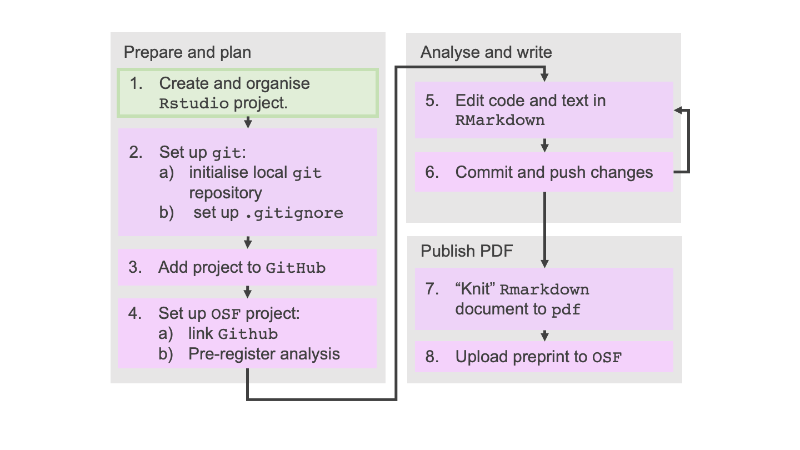

---
# Please do not edit this file directly; it is auto generated.
# Instead, please edit 02-RStudio.md in _episodes_rmd/
title: "The RStudio integrated development environment"
teaching: 35
exercises: 10
questions:
 - "What is an Integrated Development Environment (IDE) and how can it make data analysis easier?"
objectives: 
- "Demonstrate the main features of RStudio for reproducible data anlysis."
- "Motivate you to learn more about the features of RStudio"
keypoints: 
- "IDEs such as RStudio make coding and data analysis easier and more reproducible."
source: Rmd
---



# Introduction
There are three technologies essential to efficient,reproducible workflows:
1. Integrated development environments (IDEs),
2. literate programming, and
3. version control. 

This episode will describe the first of these with `RStudio` as its example.  

The goal of an IDE is to make coding and data analysis easier. 
IDEs are often tailored to specific languages (or sets of languages) but there is a set of 
features which are common to all.  These features are: 

1. A project management system
2. Language interpreter (and/or compiler)
3. Debugger
4. Version control
5. Lots of other *little* things e.g. file manager, interactive language console, bash terminal,
  syntax highlighting, autocomplete...

> ## Some useful IDEs
>
> * For `R` there is [RStudio](https://www.rstudio.com/) and [RStudio cloud](https://rstudio.cloud)
> * For `Python` there is [PyCharm](https://www.jetbrains.com/pycharm/)
> * For general purpose there is [Visual Studio Code](https://code.visualstudio.com/) or [Sublime Text](https://www.sublimetext.com/). 
> * For data science applications [Jupyter Lab](http://jupyter.org/) project is powerful. 
> 
{: .callout}

This episode will familiarise you with all the main features of `RStudio cloud`. These map to the features of the desktop application `RStudio local` which you may be familiar with, with a few minor differences. We will be demonstrating the following features:
2. organising analysis into `Projects`;
3. the panes for special features, such as keeping track of variables;
3. tools for writing and running R code;
5. finding and squashing bugs with the debugger. 

The big feature not covered is version control, this will be covered in [episode 4]({{ page.root }}).

To help you get to grips with the main features, a useful `RStudio` cheat-sheet can be found [here](https://rstudio.com/wp-content/uploads/2016/01/rstudio-IDE-cheatsheet.pdf), and to learn about the many `RStudio cloud` features you should go to the online documentation [here](https://rstudio.cloud/learn). 

# Analysis is organised in Projects

`Projects` keep track of settings tied to a particular data analysis project. When starting a new project you will create a new `RStudio` `Project`. If you want to continue working on something,  just open up the relevant `RStudio` `Project`. 

In order open an existing project:
1. `RStudio cloud`: your projects will be listed under `Your Workspace`
2. `RStudio local`:  click on the `[project_name].Rproj` file in a file browser (your system file browser or the `RStudio` file browser); OR through RStudio menus: `File` > `Open Project...`/`Recent Projects`.

## Setting up RStudio projects

You should already have a project called `roar` but just in case you haven't, complete either one of the exercises below, depending on whether you're using `RStudio local/cloud`. 

> ## Create a new `RStudio cloud` project
> 1. Navigate to [rstudio.cloud](rstudio.cloud)
> 2. Navigate to the `Your Workspace` tab. 
> 3. Click `New Project`
> 4. Rename `Untitled Project` to `roar`. 
{: .challenge}

> ## Create a new `RStudio local` project
> 1. Open RStudio
> 2. Select `File` > `New Project` > `New Directory` > `New Project` 
> 3. `Directory name`: "roar"
> 4. `Create project as...`: Select a convenient directory
> 5. Select `Create Project`
{: .challenge}

You'll also need to install the required packages so please run the following: 

```r
list.of.packages <- c("tidyverse", "data.table", "knitr", "markdown", "rmarkdown")
new.packages <- list.of.packages[!(list.of.packages %in% installed.packages()[,"Package"])]
if(length(new.packages)) install.packages(new.packages)
```

## Course directory structure
You should also create the following directory structure which will help organise the material of 
this course: 
```
roar
/episode_2_rstudio
/episode_3_rmd
/episode_4_vcs
```

Please put material from each episode into the relevant folder. 


## RStudio layout can be customized

RStudio is organised into four panes each with a series of tabs. Their layout can be customized in the global options menu. To introduce this menu let's make sure we've all configured our session the same way. 

> ## Rstudio set up
> 1. Open `Tools` > `Global Options`
> 2. Select the `Pane Layout` tab.  
> 3. Configure your RStudio with the following layout: 
>     1. Bottom left: `Console` and `Terminal`
>     2. Top left: `Source`
>     3. Top right: `Environment`, `History`, `VCS`
>     4. Bottom right: `Files`, `Plots`, `Packages`, `Help`, `Viewer`
> 4. Select the `Terminal` tab. 
> 4. Under `New terminals open with:` select `Bash` (or `Git Bash`)
> 4. Select `OK`
{: .challenge}

There are lots of options in the `Global Options` and `Project Options` menus which allow you to customize your environment. Please spend one minutes browsing the headings to see what customizations are available. 

> ## Global vs Project properties. 
> Pane layout is a 'Global property', that is, it will persist across different RStudio sessions.  
> There are project specific properties in the `Tools` > `Project options...` menu. Please  
> familiarise yourself with both sets of options. 
{: .callout}

<!-- Now look at `Files` pane (bottom right). You should see: -->
<!-- 1. `project.Rproj` (might be called `roar.Rproj` on `RStudio local`.) -->
<!-- 2. `.Rhistory` -->

<!-- The `Rproj` is a text file which contains all of the project  -->
<!-- specific settings. To see how `Projects` can benefit you we'll create some files, close and reopen -->
<!-- the project.  -->

## Project files make analysis easier

One of the main benefits of `Projects` is that after previously working on a project, you can open it up again, and start where you left off. This is in terms of the project settings, the  variables you created, the packages you imported, and your history of commands you ran. 

Let's investigate this with an exercise: 

> ## Starting where you left off
> 1. Select `File` > `New File` > `New R Script` 
> 2. Write out the following in the file (or just copy and paste!): 
> 2. ~~~
>    x <- rnorm(10)
>    
>    sum <- 0
>    
>    for(i in 1:length(x)){
>        sum <- sum + x[[i]]
>    }
>    
>    print(sum)
>    # save.image() and savehistory() are only needed for this lesson in RStudio cloud for 
>    # demonstration purposes - don't put them in your scripts!
>    save.image()
>    savehistory()
>    ~~~
>    {: .language-r}
> 3. Save the file as `start_again.R`
> 4. `Source` the file so that it runs. 
> 5. Observe the creation of the `sum` and `x` variables in the `Enivronment` pane (top right)
> 6. `RStudio cloud`: Log out and reopen RStudio.
> 6. `RStudio local`: Close and reopen RStudio (making sure to `save` your data on exit). Make sure you read the 
> message!
> 7. If RStudio doesn't open up to the same project:
>    1. `RStudio cloud`: find it in the `Workspace` tab. 
>    2. `RStduio local`: Under the `Files` pane (bottom right) find and click on the `roar.Rproj` file.
> 8. Type `x` or `sum` in the console - these should be recognised by the `R` interpreter and have the same value as before. 
{: .challenge}

Now answer these questions: 

> ## History and data
> You should now have a number of new files in your project. 
> What is the `.RData` file?  Hint: clear objects from your `Environment` (the broom icon next to `Import Dataset`), then click on `.RData` in the `Files` pane. 
> > ## Solution
> > The `.RData` contains all your data! i.e. variables, functions, dataframes etc. in your 
> > environment. 
> {: .solution}
> What does `.RHistory` file do? Hint: Just click on it. 
> > ## Solution
> > The `.RHistory` is a text file containing all your previous commands. 
> {: .solution}
{: .challenge}

This contents of the `.Rhistory` file can be found in the `History` tab, and the contents of the `.RData` file can be found in the `Environment` tab. In `RStudio cloud` the history and data files are saved in the background, not as explicit `.RData` and `.RHistory` files.  

> ## When things go wrong
> Sometimes your project session will become corrupted, or start doing unexpected things. 
> The first thing to try when debugging is to remove your `.RData` file  from the project and 
> and clear your environment. Then try doing whatever your trying to do again. 
> Very often the cause lies within a dodgy object in the saved environment. 
{: .callout}

The `[project-name].RProj` file is a text file containing your project settings. You shouldn't need to this. Clicking on this file will open a `Project` if it's not already open, or open the `Project Options` tab if you've already opened that project. 

# Specilized panes have useful features

Each pane of `RStudio` has a special feature which helps you write code and manage your project. Let's go through them now: 

1. `Console` - Runs `R` commands. 
2. `Files` - File navigator. 
3. `Terminal` - is the same as `Console` but for the `BASH/Git BASH` shell-language (or whatever shell language is available to you, e.g., `Powershell` on Windows).  This is useful for managing files and for doing complicated things with version control (not covered in this course). If you have `BASH/Git-BASH` try typing `pwd` to see what it does. 
4. `Packages` - shows a list of all the packages you have installed. 
5. `Help` -  is the help files for all installed packages. 
6. `Git` - we'll go through later (shout if you don't have this!)
7. `Environment` - as already mentioned, contains all your saved  variables/functions/dataframes etc. 
8. `History` - a list of previously run commands. 

Let's have some more practice with `Environment` and `History` with two short exercises: 

> ## Environment 
> The environment pane contains all the objects in your session, e.g. functions, variables, 
> dataframes etc. There is more than one environment however, the default one shown is the 
> `Global Environemt`.  Select the `package: datasets` environment.  What does it show?  What happens
> if you click on an object there? 
> > ## Solution
> > It shows all the objects in the base R package `datasets`. If you click on an object it 
> > opens the dataset. 
> {: .solution}
> Try loading an installed package e.g. by running `library(data.table)` in the console. 
> Now open that environment and click
> on the `Value`, `melt`. What happens?
> > ## Solution
> > The code is displayed in a new window pane. 
> {: .solution}
{: .challenge}

So the `Environment` shows all the environments that are available to you. This includes all the loaded libraries. 

> ## History
> The history pane shows you all the previous commands that have been run. 
> Run the following command in the console: 
> ~~~ 
> y <- rbeta(10, 1, 2)
> ~~~
> {: .language-r}
> Now use the History pane to transfer this (with one click) to the last line of `start_again.R`. 
> > ## Solution
> > Highlight the relevant line and then click `To Source`. Make sure your curser is on a new line.   
> {: .solution}
{: .challenge}

This feature of `History` is particularly useful - you can use it to iteratively build up your `R` script by: first trying things out in the console and second, easily transfer them to your script when you're happy with what they do. The `History` pane is searchable as well so you can add commands from previous sessions. 

# RStudio has tools for easy code writing and running

Other great features are:
1. tab complete, 
2. multiline editing,
3. keyboard shortcuts. 

Note: the keyboard shortcuts won't work in `RStudio Cloud` as they clash with your browser shortcuts. 

> ## Tab complete
> To explore tab complete, try the following: 
> 1. Type `z <- r` in the `start_again.R` file on a new line. 
> 2. Now hit the tab key (<kbd>Tab</kbd>) and you should see a list come up full of functions, datasets and packages all starting with the letter <kbd>r</kbd>. 
> 3. Now type <kbd>u</kbd> and you should see the menu change. 
> 4. Use the curser or your arrow keys to highlight `runif` and hit <kbd>Tab</kbd> again.
> 5. You should have `z <- runif()` automatically typed out. 
> 6. With the curser inbetween the parenthses, hit <kbd>Tab</kbd> again. 
> 7. A list of the required function arguments are shown (next to purple slanted rectangles) and other variables (yellow slanted rectangles). 
> 8. Make sure the `n = ` is highlighted and hit enter <kbd>Enter</kbd>, type `10`, your line should now look like `z <- runit(n=10)`. 
> 9. Fill in the remaining function arguments with `min=1` and `max=2` using tab complete (you'll need to put the <kbd>,</kbd> separating the aguments in yourself). 
{: .challenge}

> ## Multiline editing
> This is very  useful for repetitive code or text. 
> 1. Create 5 blank lines in `start_again.R`. 
> 2. Click your curser to the top of those lines. 
> 3. Hold down <kbd>Alt</kbd> and drag your curser down 5 lines. 
> 4. Type `# I love R`. (You'll need the # so it is a comment). Click <kbd>Esc</kbd> to stop multiline editing. 
> 5. You should see 5 lots of 'I love R'. 
{: .challenge}

> ## Keyboard shortcuts
> See if you can the following **without** using the mouse. Use the `RStudio` cheat sheet ([here](https://rstudio.com/wp-content/uploads/2016/01/rstudio-IDE-cheatsheet.pdf)): 
> 1. Create a new `R` file. 
> 2. Save it as `semicircle.R`
> 3. Use tab complete to help you write out the following: 
>     ~~~
>     x <- seq.int(from = -1, to = 1, length.out = 100)
>     y <- sqrt(1-x**2)
>     plot(x, y)
>     ~~~
>     {: .language-r}
> 4. Save file. 
> 5. Run it using `Source with echo`. 
> 6. Switch to the console and save the image by typing `save.image(file='episode_2_rstudio/semicircle.png')`
> 
> > ## Solution
> > 1. <kbd>Ctrl</kbd>+<kbd>Shift</kbd>+<kbd>N</kbd>
> > 2. <kbd>Ctrl</kbd>+<kbd>s</kbd>
> > 3. Use tab complete as per the previous challenge. 
> > 4. <kbd>Ctrl</kbd>+<kbd>s</kbd>
> > 5. <kbd>Ctrl</kbd>+<kbd>Shift</kbd>+<kbd>Enter</kbd>
> > 6. <kbd>Ctrl</kbd>+<kbd>2</kbd>
> {: .solution}
{: .challenge}

# The debugger helps you find errors
Debugging is essential when you anything more than a few simple lines of code. 
You can find a summary of RStudio debugging tools [here](https://support.rstudio.com/hc/en-us/articles/205612627-Debugging-with-RStudio#introduction). 
This link also contains links to more advanced tutorials. 
             
When you've got to this point, please let your instructor
know (`Zoom` green tick or green Post-It note) as we'll go through the debugger together. 

You'll need to have the following code in a new R script: 

````markdown
```{r}
# Create erroneous data
estimates <- runif(100)
estimates[[3]] <- -999
df <- data.frame(x=estimates)

# do analysis
sd <- sd(df$x)
mean <- mean(df$x)

z_score <- function(est, mean, sd){
  diff <- est-mean
  z <- diff/sd
  return(z)
}


z_scores <- vector(length=dim(df)[1])
for (i in 1:dim(df)[1]){
  # browser()
  est <- df$x[[i]]
  z <-  z_score(est, mean, sd)
  z_scores[[i]] <- z
}

hist(z_scores)
```
````

> ## Further reading
> Mastering all the features of an IDE is time consuming but well worth it. 
> Check out RStudio tutorials by clicking [here](https://support.rstudio.com/hc/en-us/sections/200107586-Using-the-RStudio-IDE)
{: .callout}

