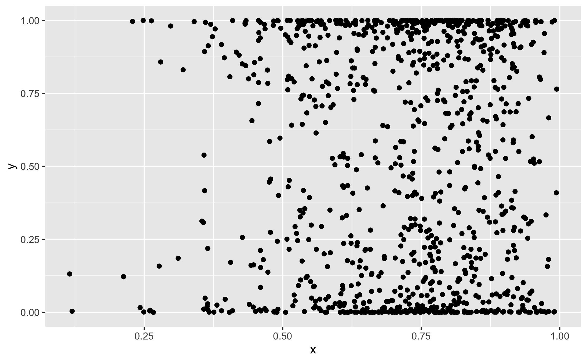

---
# Please do not edit this file directly; it is auto generated.
# Instead, please edit 04-RMarkdown.md in _episodes_rmd/
title: "Literate programming with RMarkdown"
teaching: 25
exercises: 20
questions:
 - "What is literate programming and how can it be used for make reproducible analysis?"
objectives: 
- "Demonstrate how RMarkdown can create reproducible analysis documents."
keypoints: 
- "Literate programming combines text and code to make readable code and reproducible documents."
- "RMarkdown fascilitates literate programming and produces good looking documents in a variety of formats"
source: Rmd
---


# Literate programming and RMarkdown

Let's start with the definition of literate programming (from [Wikipedia](https://en.wikipedia.org/wiki/Literate_programming)):

*Literate programming is a programming paradigm introduced by Donald Knuth in which a computer program is given an explanation of its logic in a natural language, such as English, interspersed with snippets of macros and traditional source code, from which compilable source code can be generated.*

RMarkdown is a method for performing literate programming and is a powerful way of presenting your analysis in a way that's easy to code and easy to read. The *"snippets of macros and traditional source code"* are your `R` analysis code. The *"explanation of the its logic in a natural language"* is your analysis report.  

This lesson will draw heavily from the following excellent resources:

> ## RMarkdown further reading
> These are all from the RStudio website:
> * [Get Started with RMarkdown](https://rmarkdown.rstudio.com/lesson-1.html) - An extensive tutorial
> * [Reference (pdf)](https://rstudio.com/wp-content/uploads/2015/03/rmarkdown-reference.pdf) - A 5 page reference of commands and concepts. 
> * [Cheatsheet (pdf)](https://rstudio.com/wp-content/uploads/2016/03/rmarkdown-cheatsheet-2.0.pdf) - A 2 page summary of the most important elements. 
{: .callout}

## RMarkdown - what is it?

**Markdown** is a simple plain-text language that can be turned into formatted text, e.g., webpages, forum posts (stackexchange, Github) etc. 

**RMarkdown** is a variant of `Markdown` which allows you to incorporate code  within the
final document. It can be turned into HTML, pdfs, word documents, books, theses etc. as well. 

The Carpentries courses (i.e., this course) are written `RMarkdown` and `Markdown`. 

## RMarkdown -  what's it good for?

Consider your normal data analysis workflow. It's probably something like this:

#### 1. Conventional workflow
1. Do some data analysis in an `R` script. Use comments to help reader understand. 
2. Save plots, tables, etc. in separate files (`fig1.png`, `tab1.csv`, etc.). 
2. Write report in Word and insert figures, tables etc. 

*Updating/changing analysis*: Edit `R` scripts, Word document, insert figures, potentially change figure lables, `fig1.png`-> `fig2.png` etc..  

*Sharing analysis*: Share data, R scripts, plots, tables, Word/Latex files. Also include how all the parts relate to each other in a README. 

With `RMarkdown` your workflow will be more like this: 

#### 2. Literate programming workflow
1. Do some data analysis in an `RMarkdown` file. All figures, tables are displayed in line - no need to save sepate files.  
2. Write your report around the code in the `RMarkdown` file. The narrative of the analysis helps the reader understand the code.  
3. One-click to create formatted Word/HTML/pdf report, or, one-click to publish to the web (requires setup - not covered in this course).  

*Updating/changing analysis*: Edit the single `RMarkdown` file and click to create report. 

*Sharing analysis*: Share data and the single `RMarkdown` file. 

This difference can be seen in the figure below which shows two directory structures the top 
with the conventional workflow, the bottom with the literate programming workflow. 


Of course for larger projects, you may have more than one `RMarkdown` file and you may have separate analysis scripts as well. An additional *major* benefit over writing documents in Word is that you can track changes with version control, but more on that in  [episode 4]({{ page.root }}). 


## RMarkdown - quick start

Let's create a quick-n-dirty RMarkdown document

> ## Create an RMarkdown file
> 1. Select `File` > `New File` > `R Markdown...`
> 2. `Title`: `Example Report`
> 3. `Author`: [Your name]
> 4. `Default Output Format`: `HTML`
> 3. Click `OK` (not `Create Empty Document`).  
{: .challenge}

You should see in your code editing pane a `RMarkdown` file called `Untitled1` with the following at 
the top: 
~~~
   ---
   title: "Example Report"
   author: "Rob Arbon"
   date: "25/11/2019"
   output: html_document
   ---
~~~
{: .source}

This is the 'front matter' - a collection of key/value pairs tells R how you want to process the output. The front matter is a powerful way of customising your document and you should consult the RStudio tutorial to find out more about this. The `RMarkdown` file needs to be saved and processed to create the final report, let's do this now. 

> ## Save and process the report
> 1. Select `File` > `Save`
> 2. `File Name:` `example_report`
> 3. Click the `Knit` button (you'll need to enable pop-ups in your Browser if you're using `RStudio cloud`)
> 4. `RStudio cloud` the output will be in a new tabl 
> 5. `RStudio local` the output will be in the `Viewer` pane. 
{: .challenge}

Before going on to explain RMarkdown, you should spend some time by yourself comparing the inputs
outputs:

> ## Compare inputs/outputs
> Take a few minutes to read through the file `Example_report.Rmd` and look at the output
> in a browser tab/`Viewer` pane. Answer these three questions: 
> 1. What does `**` do to text? 
> 2. How do you denote headings? 
> 3. How do you insert code? 
> 
> > ## Solution
> > 1. Makes text bold. 
> > 2. With hashtags/octothorps/pound symbols: <kbd>#</kbd>. 
> > 3. Inbetween three back apostrophes: <kbd>`</kbd>. 
> {: .solution}
{: .challenge}


## RMarkdown - syntax


> ## Real-time Markdown
> It may be useful for you to learn Markdown (not RMarkdown) by seeing how the syntax translates into output in real time. To do this you should use `Hackmd`. 
> 1. Navigate to [hackmd](https://hackmd.io/). 
> 1. Sign up with your Github account. 
> 2. Click on `New Note`
> 3. Write `Markdown` on the left hand pane and see the output on the right hand pane. 
{: .callout}

What follows is a non-comprehensive guide to RMarkdown syntax. The `code` blocks show the RMarkdown syntax, and underneath is the output. Read through it and then you can proceed to the exercise at the end.  

### Headings

#### Input
~~~
    # Heading 1
    ## Heading 2
    ### Heading 3
~~~
{: .source}

#### Output

# Heading 1
## Heading 2
### Heading 3

### Lists
Note - actual numbers don't matter, just have a number and a period `.` The sub-items have been indented by a tab space.  
#### Input
~~~
    1. Item 1
    1. Item 2
      1. sub Item 1
      3. sub Item 2
    2. Item 3
~~~
{: .source}

#### Output

1. Item 1
1. Item 2
    1. sub Item 1
    3. sub Item 2
2. Item 3

### Bullets
#### Input
~~~
    * Item 1
    * Item 2
        * sub Item 1
        * sub Item 2
    * Item 3
~~~
{: .source}

#### Output
* Item 1
* Item 2
    * sub Item 1
    * sub Item 2
* Item 3

### Links
#### Input
~~~
[link text](www.google.com)
~~~~
{: .source}

#### Output
[link text](www.google.com)

### Images 

#### Input
~~~~

~~~
{: .source}

#### Output


### Code chunks

#### Input
You can also include code in code  and the output of code in 'code chunks'.

````markdown
```{r}
x <- rnorm(2)

for(i in 1:length(x)){
  print(x[[i]])
}
```
````

You run the code by clicking the little triangle icon in the top right: 


#### Output
This prints the code and the result:

```r
x <- rnorm(2)

for(i in 1:length(x)){
  print(x[[i]])
}
```

```
## [1] -0.6116017
## [1] 0.6593419
```


### Plots

As you can tell from the example document we `knit`ed at the start you can also show plots:

#### Input
````markdown
```r ''`{r}
library(ggplot2)
x <- rbeta(1000,5,2)
y <- rbeta(1000,0.3, 0.3)
ggplot(data.frame(x,y), aes(x=x, y=y)) + geom_point()
}
```
````

#### Output

gives the following code and plot
~~~
library(ggplot2)
x <- rbeta(1000,5,2)
y <- rbeta(1000,0.3, 0.3)
ggplot(data.frame(x,y), aes(x=x, y=y)) + geom_point()
~~~
{: .language-r}


### Inline code

You can also put code inline with text. 

#### Input
````markdown
```r ''`{r}
x <- rbeta(1000,5,2)
```
````

The mean of the observations is `` `r mean(x)` ``

#### Output


```r
x <- rbeta(1000,5,2)
```

  
The mean of the observations is 0.7192117. 


## Exercise

> ## Reproduce and extend an analysis. 
> A small piece of exploratory analysis was done on the `Old Faithful` dataset. While it was done in `RMarkdown` only the a html document is available. You want to reproduce and update this analysis. 
> 1. Download the zipped html report from [here](https://gist.github.com/RobertArbon/fc36253608346ddd35b91283bf4b8f73), extract it and open it in a browser. 
> 1. Create a fresh RMarkdown document and reproduce the given report. You'll need to look at the cheat-sheet [here](https://rstudio.com/wp-content/uploads/2016/03/rmarkdown-cheatsheet-2.0.pdf) and you can copy and paste chunks of text if you wish. 
> 2. Add another section entitled 'Updated analysis' which makes the plot mentioned in the 'further work' section. Comment on the chart. 
> 2. Knit to a pdf by selecting `Knit to pdf` from the `Knit` menu. How does the front matter change? 
> 
> > ## Solution
> > The `RMarkdown` file used for the full analysis (including the 'Updated analysis')
> > can be downloaded [here](https://gist.github.com/RobertArbon/51a6622ac67609e98fafc1f1b6b764ad). Download it and compare it to yours.
> > In the front matter an additional `pdf_document` has been added as part of an indented list under `output`.  
> {: .solution}
{: .challenge}


There's lots more that can be done with RMarkdown, please read go through the tutorial to find out more. You'll also have a chance to play around with it in [episode 5]({{ page.root }}). 
