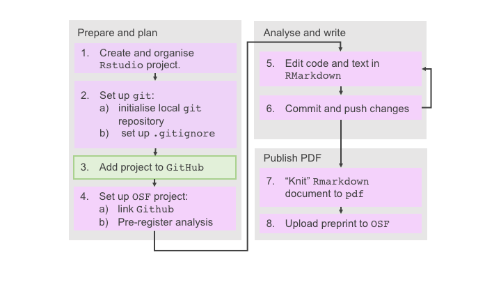

---
# Please do not edit this file directly; it is auto generated.
# Instead, please edit 05-version-control-RStudio.md in _episodes_rmd/
title: "Version Control in RStudio"
teaching: 40
exercises: 80
questions:
- "Why use version control?"
- "What is the difference between Git and GitHub?"
- "How can I use Git from inside RStudio?"
- "How can I link my local Git repository to GitHub"
objectives:
- "Have an overview of issues surrounding the reproducibility crisis and current ways to avoid those pitfalls."
- "Be aware of the tools and practices that are used in your area of research and how they may contribute to the reproducibility crisis."
keypoints:
- "Git is like an unlimited undo button that also helps you work with others"
- "GitHub keeps a public copy of your Git repository, with extra functionality"
- "Introduce yourself to git using the `git config` command."
- "Make a new branch whenever you want to do a new task"
- "Use ```git add```, then ```git commit```, then ```git push``` to copy snapshots that you're happy with from your local files to the public copy on GitHub"
- "Merge branches back into the master branch when the task is finished"
source: Rmd
---


## Git and GitHub
Git is a tool for keeping track of different versions of your files, while [GitHub](http://www.GitHub.com) is a website for hosting and managing projects using Git.

When you set up a project with Git and GitHub, you can choose to set up Git first, or set up GitHub first.

We've chosen to set up Git first, since:
1. This is likely to be what you need to do with your own research, e.g. if you have some existing code that you need to move to Git/GitHub
2. It makes sense to explain GitHub first before we move on to GitHub.

## Why use Version Control?
Version Control is a way of keeping multiple versions of a file.

A simple example of version control would be "undo" functionality (for example in Word). This saves different versions of your document every couple of seconds, and allows you to go back to previous versions. We can all agree that "undo" is very useful(!), but it has limitations:
- It's only easy to get back to recent versions.
- It can only save so many versions.
- The versions aren't labelled or organised.
- It only allows you to access your versions (not your collaborators).

So, think of Version Control, like an unlimited undo. And one where you can choose the version that you want to go back to, and you can look at other people's versions, too.

Google Docs has versioning functionality that solves some of these problems (for Google Docs documents specifically), and Word's track changes feature does similar things, too, but we are going to look at a Version Control System that is good for **any** text-based file: *Git*. There are others (e.g. SVN, and Mercurial), but Git is by far the most common/popular.

### How Version Control helps make your work reproducible

[](http://www.phdcomics.com)

Version control helps you to avoid all of these problems:
* I have come up with my own (confusing) naming conventions to make sure I have every possible version of my work, and I can't tell which is which 2 weeks later.
* This code used to work, but I changed something and now it doesn't
* I can’t remember how I made this file/graph - it doesn’t do the same thing any more
* When I work on my code/document, it means that I have to break the "clean" version for a time
* I had to spend all my money on extra hard drives to store the 8,329 copies of my thesis.

Using Version Control also opens up a world of really useful, reproducibility-enhancing software development tools, for automating things like testing and documentation.

## What is Git, and how does it work?
Git is a Version Control System, which means it is a tool for versioning files.

Git starts with a starting version of a file. Then when we ask it to make a new version, it takes a snapshot of the *differences* from the last version, line by line. In this way it makes a sequence of versions, organised by time (like "undo"), like so: 

Because it is only storing the differences, we don't use up all of our storage by making loads of copies of our work!

The differences between the sequential versions are called *commits*.

As well as storing the contents of the commits, it also stores information such as who made the change, when they did it, and what they said the change was.

## Git Setup
 You should already have done most of the work in getting it working in the [setup instructions](setup.md), but there are a couple of extra things to do after installing.


### *Config*uring Git, or "introducing yourself"
Generally, you can tell Git what to do on the command line (i.e. in the terminal), or via RStudio. We'll be doing the latter for most of the workshop, but one thing that we can't do in RStudio is configure git.

You need to tell Git who you are (your username), and how to get in touch with you (your email address). Git considers this to be essential information to add to commits. You only need to configure Git once ever for each computer you use (Each RStudio Cloud project runs on a different computer, so you will need to set it up per project there).

On a command line, Git commands are written as: `git verb options`, where `verb` is what we actually want to do and `options` is additional optional information which may be needed for the verb. 

> ## Exercise: Configure Git
> Open the terminal and type the following, but for your details. Please make sure that you **use the same email as you use for GitHub**!
> `git config --global user.name "Natalie Thurlby"`
> `git config --global user.email "natalie.thurlby@gmail.com"`
{: .challenge}

The `--global` option tells Git that you want to use this configuration for the whole computer.

### *Init*ialising the repository
Unlike Microsoft Word's track changes, Git tracks the version of **all files** in a directory (folder) at once. 

The Git *Repository* (or repo) is where a version control system stores the full history of snapshots of a project, and metadata about who changed what, and when. This information is saved in a folder called `.git` which will be in the folder that you want to track.

> ## Exercise: Initialise the repository
> Set this up by choosing 
> `Tools` > `Version Control` > `Project Setup`
> And choosing `Git` from the drop-down menu. 
> You will be asked if you want to save your project, as RStudio needs to restart. You will know that this has worked when you can see a new file in the file viewer called `.gitignore`
{: .challenge}

### `.gitignore`
Since Git keeps track of all files in a folder by default, we need to tell Git specifically if we want to ignore any files. There are a few reasons we might want to ignore files:
- We aren't allowed to share them
- Sharing them would be counter-productive to reproducibility (i.e. the files are distracting or not useful)
- Saving lots of versions of the files would take up a lot of space.

Usually, we want to ignore:
- Data, where there are privacy concerns, or if the data are very large.
- Large, non-text files (e.g. images and PDFs)
- Files that your project doesn't use
- Files that are particular to you as a user (e.g. `.Rhistory` and `.Rdata`)
- Files that are generated by another process (e.g. knitted html version of your Rmarkdown documents).

> ## Ignoring Data
> If you `.gitignore` your data, be sure to provide data elsewhere that people can use to run your analysis. This can be synthetic data if you can't make your real data freely available.
{: .callout}

If we look inside our generated `.gitignore` file, we will see that it's a plain text file, and that RStudio has done us a favour and filled this in with the basics already. You should see the following:
```
.Rproj.user
.Rhistory
.RData
.Ruserdata
```

In a `.gitignore` file, each line is a different thing that we want to ignore. In addition to stating specific files and folders that we want to ignore, we can also pattern-match, for example `*.pdf` will ignore all files with the file extension `.pdf` (the star means wild card, i.e. anything can go here).

It's important to **set up your `.gitignore` file as soon as you set up your Git repository**, i.e. before you start taking "snapshots" of your files). This is because **Git will continue to track files that it is already tracking**. I.e. if you add `*.pdf` to your gitignore file, when Git is already tracking a PDF, it won't stop tracking the PDF.

> ## Update your `.gitignore` file.
> > ## Solution
> > Based on the rule-of-thumbs above, decide what you should be ignoring, and add some new lines to your `.gitignore` file to reflect that.
> {: .solution}
> The new lines of your file should include:
> ```
> *.pdf
> *.html
> *.png
> ```
{: .challenge}

Make sure that you save your `.gitignore` file after making changes! 

### Create your `main` "branch"
In Git, work takes place on "branches". Branches are different strings of commits, where new versions diverge from each other.


You will get a lot out Git if you remember one thing: **the `main` branch should always contain a working, share-able version of your code/documents.** 

Branches are called branches, because they "branch off" from one-another: usually, they branch off the trunk (the `main` branch). In order to keep the `main` branch working, we do most of our work on other branches, and then we "merge" them back into the main branch when we're ready. 

These "tree" diagrams are common ways of visualising Git repositories, each dot is a commit, and the different colours represent different branches.


But first, we set up our `main` branch.

> ## Create your `main` branch
> 1. Navigate to your `Git` pane in RStudio, and click the new branch button (which looks like purple squares). 
> 2. Name your branch "main".
> Don't worry that you won't be able to notice any changes straight away. The Git pane will say "no branch" until you make your first commit.
{: .challenge}

> ## The `master` branch?
> In older (pre-BLM) Git repositories you will see the that the `main` branch is often called the `master` branch - this is the same thing.
> You will also see this terminology used in a lot of online tutorials that haven't been updated yet. Thankfully the tech community is now moving away from this terminology.
{: .callout}

### Make your initial "commit"
Creating a snapshot is a two-stage process:
1. First we must _"add"_ or _"stage"_" files: this means telling Git that they are a file that we want to track the changes of. 
2. Then we decide that we are ready to take the snapshot, which is when we _"commit"_ to saving this version of our files.

Staging is like staging the photo, and commiting is like taking the photo.

> ## Your first **commit**!
> 1. **Go to the `Git` pane in Rstudio, and open the "commit" window** - you should be able to see all the files except the ones that you have mentioned in your `.gitignore` file. They should have orange question marks next to them (which means that Git is not tracking them yet).
> 2. **Tick boxes next to the files that you want to commit** - this *adds* them to thes staging area, and you will see the orange questionmark become a green "A". Alternatively, you can click on the file name and click "stage".
> 3. **Enter a commit message, click "commit"**. "Initial commit" is the traditional first commit of a repository. You MUST write a commit message or you will see an error because Git knows that commit messages are essential. 
> A new window will appear letting you know what you have changed, e.g. "1 file changed, 1 insertion(+)". You can close that and the commit pane when you are finished. You should now be able to see that you are in the "main" branch. Congratulations on your first commit!
{: .challenge}

### Making a new branch
Now you have your `main` branch, it's time to remember the golden rule of Git: keep your main branch clean, working and shareable.

We want to write a new document, but it will be a little messy while we're setting it up, so it's time to make a new branch!

> 1. **Create a new branch called "writing"**.
> 2. **Make a new folder called "episode_5_git"** - notice that it doesn't show up in the Git pane yet: that's because Git doesn't track empty folders.
> 3. **Make a new RMarkdown document called `paper.Rmd`**, give it some headings, and save it inside the `episode_5_git` folder.
> 4. **Stage and commit changes to the new document**. 
{: .challenge}

### Practicing the Git workflow
The majority of the time when we use Git, we are making changes to documents, then telling Git about those changes.

Let's practice doing this in our document, filling out one section at a time.
> ## The Git Workflow
> In the `writing` branch, make changes to `paper.Rmd`, filling out one section at a time. Fill out each section, then:
> 1. Save the document
> 2. Add the document to the staging area
> 3. Commit changes to document
> Do this at least three times!
{: .challenge}

---

## Git Summary
Git is a Version Control System: a tool that keeps track of file changes for us within a directory.
It allows us to decide which changes will be made to the next version (each record of these changes is
called a [commit]({{ page.root }}#commit)), and keeps useful metadata
about them. The complete history of commits for a particular project and their
metadata make up a [repository]({{ page.root }}#repository).

## GitHub
Meanwhile, [GitHub](http://www.GitHub.com) is a website and community, where you can view, share and project-manage projects that use Git.

It helps people keep Git repositories sync across different computers, facilitating collaboration among different people.

### Why use GitHub?
Problems that GitHub solves:
* I can't publish my paper/work with other people/show off this cool thing I did because my code is only on my computer.
* I find it difficult to organise my code, when I come back to it, I don't know what to work on next. This also makes it difficult to get other people to help me with it.
* My laptop got smashed/stolen and it contains all my work for the last 5 years and I never backed it up anywhere ARRRGHHHH

### GitHub intial setup



> ## GitHub setup
> 1. Login to [GitHub](http://www.GitHub.com)
> 2. Go to `Repositories` > `New` and create an empty repository called "roar_workshop".
> 3. Choose the HTTPS tab, then copy the first line of code ONLY for pushing an existing repository from the command line, and paste it into your RStudio terminal, e.g. ```git remote add origin https://github.com/YOURUSERNAME/roar_workshop.git```. This tells Git that you are adding a new remote place where you want to keep track of your Git repository.
4. Type ```git push -u --mirror``` into your RStudio terminal. This will "push" your local code to GitHub and "mirror" the branch structure. You will need to put in your username and password. To check that it has worked, refresh your GitHub page and you should see that your code is now in both places!
{: .challenge}

> ## HTTPS or SSH
> Choosing the HTTPS tab means that you will be asked for your GitHub username and password a lot in this session.  
> Setting up the SSH key is what you should do in the long run, for your main computer/laptop - this means you won't be asked for your username and password after the initial setup.
{: .callout}

## Pulling and Pushing
To set up GitHub, we used the `git push` command to push our local changes on our computer to GitHub's remote location.

Pushing is an extra step that we need to do every time after committing. This keeps our GitHub up to date with our computer. Now that we're all set up, we can also push changes using the RStudio interface (without using the command line), using the green up "Push" arrow in the Git pane.

Pulling is the opposite of pushing: it's pulling changes from GitHub to our local copy of the repository. Since other people can make changes to the remote (GitHub) repository, and since we could also make changes directly to the remote GitHub repository, we should always pull before making changes. We can pull using the blue down "Pull" arrow in the Git pane.


So our work flow is now:
1. *Pull* any changes from GitHub
1. Make changes to our file and save it
2. *Add* our file to the staging area
3. *Commit* our changes with a message
4. *Push* our changes to GitHub

I'm going to demo this, then I'd like you to practice doing it a few times.

> ## The Git/GitHub Workflow
> In the `writing` branch, let's finish our `paper.Rmd`:
> 1. Edit and save the document
> 2. Add the document to the staging area
> 3. Commit changes to document
> 4. Push the changes to GitHub (refresh GitHub and check they are there)
> Do this at least twice!
{: .challenge}

## Pull requests
When we're done with a new our feature, it's time to merge all of our changes on the branch back into the main branch. 

On GitHub, this is called a pull request: requesting the owner of the repository to pull some changes into their main branch. This part is all on GitHub.

> ## Your first pull request
> 1. Go to your GitHub repository
> 2. Choose `Compare and Pull request`
> 3. Ensure that you are pulling into your `main` branch, from your `paper` branch. 
> 4. Write an informative message about what you did and click `Create Pull Request`.
> 5. When you see a green tick, with the message "This branch has no conflicts with the base branch",  choose `Merge Pull Reqest`.
> 6. `Confirm Merge`
{: .challenge}

> ## Git is hard to learn
> Doing your first pull request is a big deal! You should be really proud of yourself when you get there (even if it isn't now for whatever reason.)
{: .callout}

## (Optional): Tour of GitHub
We will look at [The Turing Way](https://github.com/alan-turing-institute/the-turing-way) for an example of a well-used GitHub repository. 
- LICENSE
- README (emojis!)
- Issues, labels, milestones
- Continuous Integration

## Take-home messages:
### Rules for making Git useful and (relatively) easy:
1. __Take lots of snapshots of your code__. Not only is this the "save your work regularly" of Git/GitHub, it also helps you document the progress that you're making.
2. __Make the snapshot labels (aka commit messages) informative__. Each time you ```commit``` you must write a commit message (Git won't let you not). The more informative these are the better.
3. __The main branch is your perfect baby__. It's the version of your code that you show to other people. It doesn't contain half-finished features. The things that are in the main branch work and you're happy with them. Because of this, things are made much easier if you branch your new branches from the master branch.

### Steps to using Git
1. Make a new branch
2. Make some snapshots 
 - A. Pull
 - B  Change and save file
 - C. Stage files
 - D. Commit changes
 - E. Push
3. Repeat 2 A-E until you're done.
4. Do a pull request to bring the branch back into master when you're happy with it.

----
These materials build on the [git novice Carpentries materials](http://swcarpentry.github.io/git-novice/01-basics/index.html) and [The Turing Way](https://the-turing-way.netlify.app/reproducible-research/vcs/vcs-workflow.html).
