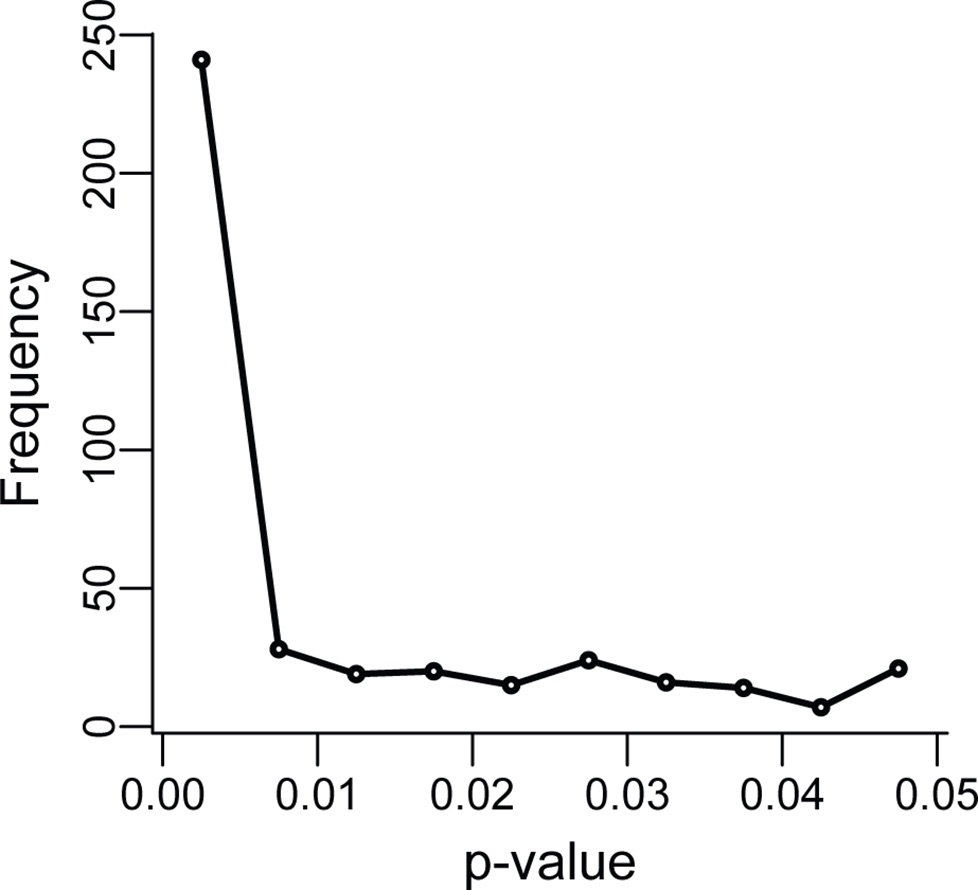

## Motivation
Today we're going to be building towards a reproducible and open work-flow for research

I'd like to begin by letting you know why it's important and exactly which problems we're trying to solve with this work flow.

It's important that we can trust the results of research because we rely on those results to inform us. We make policies and laws, and choose which avenues of our own research to explore. If research is untrustworthy, that could result in anything from wasting time and money, to causing a PhD student distress, or even costing lives (by influencing policy or drug availability for example).

Aside from the important benefits for society, we also want others to trust our research as it's connected to our reputation, and our success in our future careers.

## What is reproducibility?
The most basic definition of reproducibility is: a research result is reproducible if you can get the __same result__ when you do the research again. Sometimes it's useful to go one step further and distinguish between different types of reproducible research.

The matrix below (from [The Turing Way](https://the-turing-way.netlify.com/)) gives a useful set of definitions:

* Results are __reproducible__ if we get the same result when we do the research again using the same analysis, on the same data.
* Results are __replicable__ if we get the same result when we do the research again using the same analysis, on different (newly collected) data.
* Results are __robust__ if we get the same result when we do the research again using different analysis, on the same data.
* Results are __generalisable__ if we get the same result when we do the research again using a different analysis, on different (newly collected) data.

>##Discussion
> In pairs discuss the following.
>
> How often do you think:
> 1. research in your area would be reproducible, if you had access to the exact data and analyses?
> 2. research in your area would be replicable, if you had access to the exact data and analyses?
> 3. research in your area provides access to the exact data and analyses?
>__(3 minutes total)__
{: discussion}

## The reproducibility crisis
The reproducibility crisis is a recent event in science, where scientific results were found to replicate much less than scientists had assumed or hoped that they would.

__Less than 40% of replications of well-known Psychology studies were found to reproduce__ (have significant results):

P-values in the original studies were constrained between 0 and just above 0.05, but in the replications, p-values ranged from 0 to 1 (with less than 40% being less than 0.05). Effect sizes were noticably lower, too.

Similar results were found in Cancer Biology (where only 11% of results replicated).
Begley, C. Glenn, and Lee M. Ellis. "Drug development: Raise standards for preclinical cancer research." Nature 483.7391 (2012): 531.

Not only that, but most researchers agree that there is a problem, and most have failed to reproduce a result.

Of the 1576 scientists surveyed, __over 70% of scientists surveyed have experienced failure to reproduce other's results__ and __over 50% have failed to reproduce their own results__.

> ## Reminder:
> * __P-values__ measure the probability of getting as convincing a result by chance assuming that there is no effect - they range between 0 and 1. The commonly used threshold for a "statistically significant" result is p < 0.05.
> * __Effect Sizes__ measure the strength of a relationship between two variables. There are different types of effect size, for example Cohen's D or the Pearson corellation coefficient.
{: .callout}

## Why did it take us so long to notice?
### Un"FAIR" data and analyses
It used to be harder to share and access data and analyses. FAIR principles describe how data/analyses need to be stored in order for them to be used by others:

- **Findable**: People need to know the data exists (e.g. link to in your paper)
- **Accessible**: Data needs to be available in a format that humans and computers can understand (e.g. downloadable on the internet, and well-documented)
- **Interoperable**: The data needs to be in a format that people usually use.
- **Reusable**: Data must be clearly licensed so people know if they're allowed to reuse them.

If data is messy, unlabelled, in a strange file format, or only on your hard drive, then no one can check if the result is correct. 

## Why is it happening?
There are lots of points in the process of doing research where something can go wrong, but lots of high profile examples (leading to retractions) come down to:
1. Data storage mistakes, e.g. accidentally deleting columns of excel files, or rewriting important values.
2. Data analysis implementation mistakes, e.g. accidentally clicking through a GUI in the wrong order, or code not doing what you think it does.
3. Questionable research practices, e.g. p-hacking.

### P-hacking
P-hacking is a catch-all term for making p-values appear smaller than they are. It includes practices like:
- Collecting samples until your sample size gives you p < 0.05
- Choosing different statistical tests until you get p<0.05
- Running lots of statistical tests and not correcting for multiple hypotheses

P-curves show evidence that this is occurring in research, particularly when p-values are close to 0.05.

> ## Discussion: Barriers to reproducibility in your field.
> We've mentioned some barriers to reproducibility so far. In small groups, first write down  the issues you remember on the paper in front of you in one colour.
>Then discuss how you think these reproducibility problems mentioned might affect your fields. 
>__(10 minutes total)__
{: .discussion}

## Solutions

### Make data available
By making your data available, you can ensure that you and others will be able to replicate your work. This can involve:
- Making your original data freely available
- Storing your original data in a secure place and only sharing it with people who meet ethical research standards.
- Making anonymised or aggregated data available.
- Synthesising data which is similar to your original data, but does not contain any real subjects, and make that available.

Whatever you make available, it must be well labelled and described if it's going to be useful for future you, or for others.

### Make analysis available
__Scripts__ make analysis available by writing scripts, they:
- Describe exactly what your analysis is and can be shared with others
- Can be written in any programming language (e.g R, Python)
- Always perform in the same order and get the same result
- Those written in non-proprietary software (e.g. R and python, rather than SPSS/Stata) are more accessible.

__Literate programming__ = scripts + describing what's happening

Ways to do it:
- Comments
- Documentation
- README files
- Notebooks (e.g. RMarkdown, Jupyter)

Much of the time this is carried out in markdown. Markdown is a way of turning simple formatting into html (to be shared on the web). It's the language of RMarkdown and GitHub.

### Version Control
* You will want different versions of your scripts/notebooks.
* Nothing is worse than knowing your program worked earlier, but that it doesn't now.
* Having files named `analysis_ver32_final_actually_final.R` is not fun and it's easy to make mistakes.
* When you come back to your work later, you won't be able to remember which is the `for_realsies_final_file.txt`
* It's difficult to add new things to your analysis at the same time as having a working version.

Version control is a system for avoiding these problems.

### Pre-registration
*The first principle is you must not fool yourself — and you are the easiest person to fool* - Richard Feynman

Pre-registering your analysis is saying what analysis you are going to do in advance, including:
* which variables you are going to look at
* what sample size you will aim for
* what you will exclude from your sample
* what variables you are going to correct for

__Pre-registration is only for analyses where you are seeking to confirm a hypothesis__

### [Registered reports](https://cos.io/rr/)

Registered reports are a new model for publishing papers. Instead of applying to journals once you have your results, you apply while after you have made plans for research and analysis, but before you have collected your data.

Extra great for research(ers) because:
* You can publish non-significant results 
* We will all be able to benefit from knowing what __doesn't__ work.

## Draw a "concept map" about reproducibility

> ## Concept map activity
> 1. Create concept maps in small groups  (10 minutes)
> 2. Feed back to the group 
>
> We already have some of the barriers to reproducibility written down (e.g. publication bias, p-hacking), so add to this by writing some of the solutions to the reproducibility crisis to your paper e.g.: pre-registration. If you'd like to you can add more specific things that you have heard of (e.g. the Open Science Framework).
>
> Then draw relationships between them, for example:
> * pre-registration --prevents--> p-hacking
{: .discussion}
