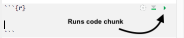
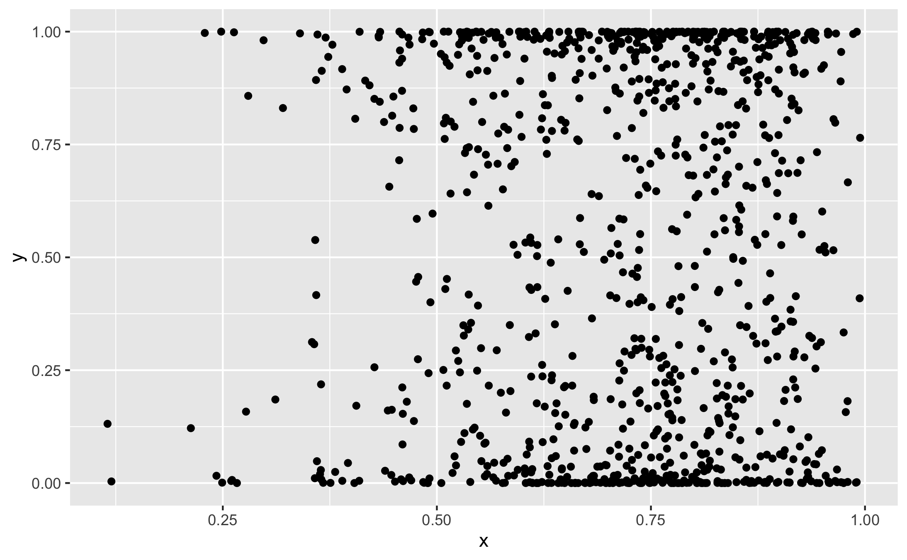

# Literate programming and RMarkdown

Let's start with the definition of literate programming (from [Wikipedia](https://en.wikipedia.org/wiki/Literate_programming)):

*Literate programming is a programming paradigm introduced by Donald Knuth in which a computer program is given an explanation of its logic in a natural language, such as English, interspersed with snippets of macros and traditional source code, from which compilable source code can be generated.*

RMarkdown is a method for performing literate programming and is a powerful way of presenting your analysis in a way that's easy to code and easy to read. 

This lesson will draw heavily from the following excellent resources:

> ## RMarkdown further reading
> These are all from the RStudio website:
> * [Get Started with RMarkdown](https://rmarkdown.rstudio.com/lesson-1.html) - An extensive tutorial
> * [Reference (pdf)](https://rstudio.com/wp-content/uploads/2015/03/rmarkdown-reference.pdf) - A 5 page reference of commands and concepts. 
> * [Cheatsheet (pdf)](https://rstudio.com/wp-content/uploads/2016/03/rmarkdown-cheatsheet-2.0.pdf) - A 2 page summary of the most important elements. 
{: .callout}

## RMarkdown - what is it?

**Markdown** is a simple plain-text language that can be turned into formatted text, e.g., webpages, forum posts (stackexchange, Github) etc. 

**RMarkdown** is a variant of `Markdown` which allows you to incorporate code  within the
final document. It can be turned into HTML, pdfs, word documents, books, theses etc. as well. 

The Carpentries courses (i.e., this course) are written `RMarkdown`, or `Markdown`. 

## What's it good for?

Consider your normal data analysis workflow. It's probably something like this:

1. Do some data analysis in an `R` script. Use comments to help reader understand. 
2. Save plots, tables, etc. in separate files (`fig1.png`, `tab1.csv`, etc.). 
2. Write report in Word and insert figures, tables etc. 

*Updating/changing analysis*: Edit `R` scripts, Word document, insert figures, (change figure lables, `fig1.png`-> `fig2.png`). 
*Sharing analysis*: Share data, R scripts, plots, tables, Word/Latex files. Also include how all the parts relate to each other in a README. 

With `RMarkdown` your workflow will be more like this: 

1. Do some data analysis in an `RMarkdown` file. All figures, tables are displayed in line - no need to save sepate files.  
2. Write your report around the analysis in the `RMarkdown` file. The narrative of the analysis helps reader understand code.  
3. One click to create Word/HTML/pdf report, or, one click to publish to the web (requires setup - not covered in this course).  

*Updating/changing analysis*: Edit the single `RMarkdown` file. 
*Sharing analysis*: Share data and `RMarkdown` file. 

An additional *major* benefit over writing documents in Word is that you can track changes with version control, but more on that in  [episode 4]({{ page.root }}). 


## RMarkdown file structure

Create a new RMarkdown document by doing the following: 

> ## Create an RMarkdown document
> 1. Select `File` > `New File` > `R Markdown...`
> 2. Select the  `Word` radio button. 
> 3. Press `OK` when the `New RMarkdown` pane appears.  
{: .challenge}

RMarkdown requires some 'front matter' which is a collection of key/value pairs at the top of the 
file which tells R how you want to process the output. The default front matter is : 

~~~
   ---
   title: "Untitled"
   author: "Rob Arbon"
   date: "25/11/2019"
   output: word_document
   ---
~~~
{: .source}

In order to create the final Word document you need to `knit` the document. This tells R to create 
a document with the specified formatting and to run all the code and insert the relevant parts 
into the document. The front matter above tells `R` to make a title ('Untitled')  and two subtitles 
('Rob Arbon' and '25/11/2019') and create a Word document (as opposed to a PDF or a 
web page). 

> ## Knit your RMarkdown doc
> 1. Click the `knit` button at the top of the RMarkdown document. 
> 1. Save as 'test.Rmd'.
> The Word document should pop up. If not search for it in a file browswer in the home directory
> of the project. 
{: .challenge}

You can now proceed to insert your text and code.

## Text syntax

What follows is a non-comprehensive guide to Markdown syntax. 

> hackmd.io 
> If you want a real time feedback on what markdown looks like navigate to 
> (hackmd.io)[hackmd.io] to try things out.  You'll need to scroll down to the bottom 
> and click 'Use for free'.
{: .callout}


### Headings
~~~
    # Heading 1
    ## Heading 2
    ### Heading 3
~~~
{: .source}

# Heading 1
## Heading 2
### Heading 3

### Lists

Note - actual numbers don't matter, just have a number and a period `.`
~~~
    1. Item 1
    1. Item 2
        1. sub Item 1
        3. sub Item 2
    2. Item 3
~~~
{: .source}

1. Item 1
1. Item 2
    1. sub Item 1
    3. sub Item 2
2. Item 3

### Bullets

~~~
    * Item 1
    * Item 2
        * sub Item 1
        * sub Item 2
    * Item 3
~~~
{: .source}

* Item 1
* Item 2
    * sub Item 1
    * sub Item 2
* Item 3

### Links

~~~
[link text](www.google.com)
~~~~
{: .source}

[link text](www.google.com)

### Images 

~~~~

~~~
{: .source}


## Code chunks

You can also include code in code  and the output of code in 'code chunks'.

````markdown
`r ''````{r}
x <- rnorm(2)

for(i in 1:length(x)){
  print(x[[i]])
}
```
````

You run the code by clicking the little triangle icon in the top right: 


This prints the code and the result:
```{r}
x <- rnorm(2)

for(i in 1:length(x)){
  print(x[[i]])
}
```


As you can tell from the example document we `knit`ed at the start you can also show plots:

````markdown
`r ''````{r}
library(ggplot2)
x <- rbeta(1000,5,2)
y <- rbeta(1000,0.3, 0.3)
ggplot(data.frame(x,y), aes(x=x, y=y)) + geom_point()
}
```
````

gives the following code and plot
~~~
library(ggplot2)
x <- rbeta(1000,5,2)
y <- rbeta(1000,0.3, 0.3)
ggplot(data.frame(x,y), aes(x=x, y=y)) + geom_point()
~~~
{: .language-r}



There's lots more that can be done with RMarkdown, please read the documentation to find out more. 
You'll also have a chance to play around with it in episode 4. 
