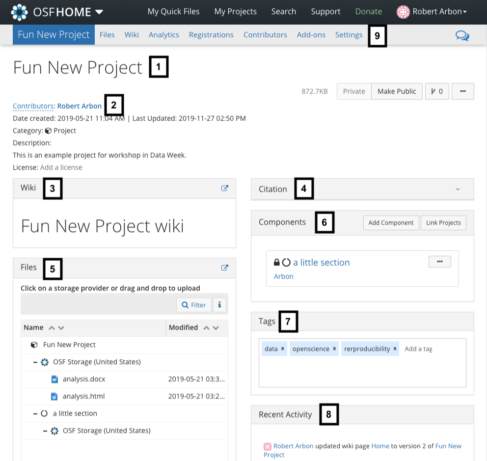
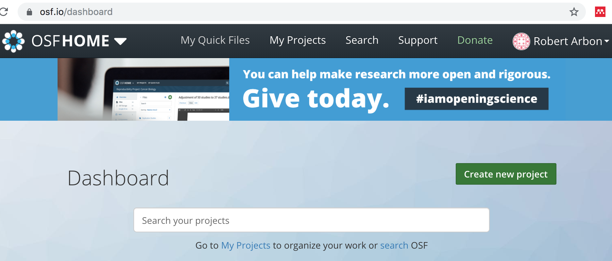

# Putting it together

We'll now be putting everything that we've leared together and practicing the workflow in its entirety. 
As an example project we'll be building on the analysis of the Old Faithful data which was started
in  [episode 3]({{ page.root }}).

## Prepare and plan

### Step 1: Create and organise RStudio project

Create a brand new project (in `RStudio cloud` or `RStudio local`) using the instructions 
[episode 2]({{ page.root }}). Call the project `old_faithful`.
Place the project somewhere convenient for you e.g., `Desktop/old_faithful`. 

### Steps 2 and 3: Set up Git and Github

Initialize a local git repository (in `RStudio cloud` or `RStudio local`) using the instructions 
[episode 4]({{ page.root }}). You should call
the repository `old_faithful`. 

Copy the `old_faithful_updated.Rmd` analysis from [episode 3]({{ page.root }}). 

Rename `old_faithful_updated.Rmd -> old_faithful_eda.Rmd`. This is to better reflect what the 
document is about (EDA = exploratory data analysis) and to differentiate it from other files that we will create. 

If you're using `RStudio cloud` you can't copy files between project. Instead upload the solutions version available [here](https://gist.github.com/RobertArbon/51a6622ac67609e98fafc1f1b6b764ad). 

Make sure you're 'ignoring' pdfs in your `.gitignore` file. 

Commit and push this. 

### Step 4: Preregister the analysis on the Open Science Framework.

We're now going to write down our analysis plan and preregister a simple hypothesis. This will be 
done in three steps: 

1. Create  an Open Science Framework (OSF) project. 
2. Write an analysis plan (a plan will be provided). 
3. Upload documents and preregister the project. 

#### 1. Create an OSF project
1. Sign up, if you haven't already, for an [osf](osf.io) account. 
2. On the dashboard click `Create new project`. Call it 'Old Faithful' and then `Go to project`. 

#### 2. Create hypothesis and analysis plan
Our hypothesis is: 

*There are 2 distinct types of eruption from Old Faithful: 1) short frequent eruptions, 2) long infrequent eruptions.*

We shall test it by clustering the data using a Gaussian mixture model (more information [here](https://brilliant.org/wiki/gaussian-mixture-model/)) with 1 and 2 components. The true number of components will be given by the model with the smallest Integrated Complete Data Likelihood (ICL) criterion. The model will be fit in the R package `RMixmod`. 

(Don't worry if you don't understand this - all the materials will be provided!)

1. Download the analysis plan [here](https://gist.github.com/RobertArbon/a5e6758280082239ae71dfd68de365e9)
2. Commit and push changes. 
2. `Knit` both `analysis_plan.Rmd` and `old_faithful_eda.Rmd` files to pdfs. 
3. Upload both `analysis_plan.pdf` and `old_faithful_eda.pdf` documents  to the OSF project. To do this navigate to `Files`, click on `OSF Storage (United States)`. The `Upload` button should appear and you can use this to upload files.  

#### 3. Preregister plan and project. 
The OSF instructions for registering projects can be found [here](https://help.osf.io/hc/en-us/articles/360019930893). Specific instructions for this project are given here: 
3. Click `Registrations` > `New registration`
4. Select `Open-Ended Registration` and then select `Create draft`. 
5. Fill in the required `Metadata`:. 
    1. Description: *An investigation into the Old Faithful geyser*
    2. License: `CC-By Attribution 4.0 International`. 
    3. Subjects: `Physical Sciences and Mathematics`. 
6. Click `Next` then fill in the `Summary`:
    1. `Summary`: *The attached file analysis_plan.pdf contains our project description, hypothesis and analysis plan.* 
    2. Select the `analysis_plan.pdf` document.
7. Now click `Reveiw`. Review your submission and when you're satisfied click `Register`. 
8. You can now click `Make registration public immediately` then `Submit`. 

The registration is now pending approval by the administrators of the project (i.e., you). If you navigate back to the `Registrations` tab of the project and click on the link next to `Pending registration`, it will bring you to your registration page. This contains the information you entered when registering the project, as well as a snapshot of the project contents, i.e., analysis_plan.pdf and old_faithful_eda.pdf.

You will get an email asking you to approve or cancel this preregistration. **You should cancel this preregistration after the course**.  

## Analysis and write

### Steps 5 and 6: Perform analysis and commit changes

1. Download the report template from [here](https://gist.github.com/RobertArbon/a0a9b71600c713db0f5b31b8712eb3b2). 
2. You will need to install `Rmixmod`. You will be asked `Do you want to install from sources the package which needs compilation? (Yes/no/cancel)` - choose `no`. 
2. Follow the instructions in the report template.  You should make a commit and push after every couple of completed tasks in the report template. i.e. you should commit and push multiple times. This is good practice. 

A completed report is available [here](https://gist.github.com/RobertArbon/491ab16f9fa81b9056fbc5614a6db880) should you need help. 

## Publish PDF

### Step 7 and 8:
1. `Knit` the completed `report_template.Rmd` to a pdf. 
2. Upload the pdf to the OSF project. 

You have now successfully completed a fully reproducible piece of preregistered data analysis!

Both the preregistration and the final analysis report are all publicly available on the OSF. 

Your code is available for anyone to use from your Github profile. 

# Conclusions

That concludes the course. In this last episode we have brought together all the elements learned in the previous episodes and applied it to an example analysis of the Old Faithful dataset. We used RStudio to create an project ( [episode 2]({{ page.root }}) ) to contain our Old Faithful analysis. Then we performed some exploratory data analysis and wrote an analysis plan using RMarkdown ( [episode 3]({{ page.root }})). From [episode 1]({{ page.root }}) we learnt about preregistration and so we preregistered our hypothesis with the OSF. We performed our intended analysis, backing up along the way using version control ( [episode 4]({{ page.root }})). We then published our report, along with our pre-registered analysis plan, on the OSF. In addition, because we used version control, our code was already published and available for use by others on Github.  

<!-- ## OSF features -->
<!-- The [Open Science Framework (OSF)](osf.io) is a great tool for sharing your work.  -->

<!-- > ## Sign up to the OSF -->
<!-- > Please go to [osf.io](https://osf.io/) and create an OSF account if you haven't already done so! -->
<!-- {: .challenge} -->

<!-- The key features that make it so useful for the purposes of reproducible workflows are:  -->

<!-- 1. **Storage**: it can store an unlimited amount of files, including raw data files,  -->
<!-- accessibly and securely. Even if the Centre for Open Science (the owner of the OSF) go bust,  -->
<!-- they have a fund to maintain the storage.  -->
<!-- 2. **Preregistrations**: You can create an analysis plan and preregister it with the OSF.   -->
<!-- 3. **Preprints**: OSF powers and integrates with many different pre-print servers.  -->
<!-- 3. **Search functions**: Your profile links to all your projects and there is a search function which  -->
<!-- makes your and other people's research findable.  -->
<!-- 3. **Add-ons**: You can link different types of services to an OSF project:  -->
<!--   * 3rd party storage: You can make a specific folder from Google Drive, Dropbox etc. available to  -->
<!--   an OSF project, allowing you to share files without any extra work.  -->
<!--   * References: link a folder from Zotero or Mendeley to share references.  -->
<!--   * Version control: You can also link Github or Gitlab to a project to share code.  -->

<!-- The supporting documentation is excellent and can be found [here](https://help.osf.io/hc/en-us);  -->
<!-- there is also guides to best practice in open science research practices which can be found  -->
<!-- [here](https://help.osf.io/hc/en-us/categories/360001530634-Best-Practices).  -->

<!-- ## OSF Projects -->
<!-- The basic unit of organisation in the OSF Project. Below is a screen shot of a project we have  -->
<!-- called 'Fun New Project'. Each part is described below.  -->

<!--  -->

<!-- 1. The title of the project. This can be changed at any time.  -->
<!-- 2. Metadata for the project: list of contributors, a short description, categorisation, license  -->
<!-- timestamps.  -->
<!-- 3. A wiki that can be used to give further description for the project.   -->
<!-- 5. A file browser for the project. This will include any linked storage (e.g. Google Drive) or  -->
<!-- Github repository.  -->
<!-- 4. A citation for the project in any style you like (from a drop down menu).  -->
<!-- 5. A self-contained *component* of the project. Components are just nested projects, i.e.  -->
<!-- they are exactly the same as a project.  -->
<!-- 6. Tags for increasing findability.  -->
<!-- 8. A public feed of updates to the project. You can subscribe to these if you're a contributor.  -->
<!-- 9. Menu bar for extra functionality:  -->
<!--     1. **Files**: a page dedicated to managing your files.  -->
<!--     2. **Wiki**: another link to the wiki editing page.  -->
<!--     3. **Analytics**: see how many times your project has been accessed or your work downloaded.  -->
<!--     5. **Registrations**:  Make a preregistration or view an existing preregistered plan.  -->
<!--     5. **Contributors**: Manage the contributors to the project.  -->
<!--     6. **Add-ons**: configure your add-ons and integrations such as Google Drive and Github.  -->
<!--     7. **Settings**: Miscellaneous settings for the project, e.g. title, email notifications, metadata.  -->

<!-- > ## Create OSF project -->
<!-- > Click on the `Create new project` (see the image below) and create a new project.  -->
<!-- > Call it `ROAR Workshop`. -->
<!-- >  -->
<!-- {: .challenge} -->

<!-- # Work flow -->
<!-- To summarise, our suggested workflow is the following (a detailed explanation is below). Many of  -->
<!-- these steps you should have already done in this workshop. We present it like this so that you have  -->
<!-- a guide for future projects.  -->

<!--  -->

<!-- ## Steps 1 and 2 -->
<!-- From episode 2 you should have already created an RStudio project called `roar_workshop` and  -->
<!-- initialized it as a `git` repository with a `.gitignore` file that ignores standard `R` and `RStudio` -->
<!-- files. If you haven't done this, navigate to  -->
<!-- [episode 2]({{ page.root }}) and follow the instructions there.  -->

<!-- ## Step 3 -->
<!-- > ## Create directory structure -->
<!-- > Using the `Files` pane in `RStudio` create the following file structure. You should already have -->
<!-- > the `test.R` and `test.Rmd` files from episode 2.   -->
<!-- > ~~~ -->
<!-- > roar_workshop\ -->
<!-- >    data\ -->
<!-- >    output\ -->
<!-- >    images\ -->
<!-- >    test.R -->
<!-- >    test.Rmd -->
<!-- > ~~~ -->
<!-- > {: .source } -->
<!-- {: .challenge} -->

<!-- * The `data` folder should contain the data you'll be using.  -->
<!-- * `output` can be used for any results tables (dataframes), model objects, etc. that you create -->
<!-- * `images` can be used to store copies of images that you might need to keep separate (e.g. for  -->
<!-- publication) -->

<!-- ## Step 4  -->
<!-- You should now link the local repository you've created to a new remote repository on Github. To make things easier you can set up SSH access to Github. This isn't necessary but if you do this you won't have to sign in when using Github from your computer. -->

<!-- Thanks to [Happy Git with R](https://happygitwithr.com/) for the instructions.  -->

<!-- > ## Optional: Set up SSH keys -->
<!-- > Follow the instructions on the Github website [here](https://help.github.com/en/enterprise/2.15/user/articles/adding-a-new-ssh-key-to-your-github-account) to set up your SSH key.  -->
<!-- {: .challenge} -->

<!-- > ## Linking local and remote repositories -->
<!-- > 1. Go to https://github.com and make sure you are logged in. -->
<!-- > 2. Click the green `New repository` button. Or, if you are on your own profile page, click on `Repositories`, then click the green “New” button. -->
<!-- > 3. Call the repository 'roar_workshop' -->
<!-- > 4. DO NOT initialize this repository with a README. -->
<!-- > 5. Click the big green button `Create repository.` -->
<!-- > 6. Copy the SSH clone URL to your clipboard via the green `Clone or Download` button. If the link starts with `https` then click the `Use SSH` button in the top right hand corner.  -->
<!-- > 7. Get back to RStudio.  -->
<!-- > 7. Click on the “two purple boxes and a white square” in the Git pane. Click `Add remote`. `Remote Name` should be `origin` (this is the usual name for it); `Remote URL`: paste the url from Github.  -->
<!-- > 8. We should be back in the `New Branch` dialog I assume you’re on the master branch want it to track master on GitHub. Enter master as the branch name and make sure `Sync branch with remote` is checked. Click `Create` (yes, even though the branch already exists). In the next dialog, choose `overwrite`. -->
<!-- {: .challenge} -->

<!-- ## Step 5 -->
<!-- You should have created an OSF project. If you haven't, do this now (see above exercise). You should  -->
<!-- now link Github the github repo as an add-on:  -->

<!-- > ## Link Github to OSF project -->
<!-- > In the `ROAR Workshop` project select the `Add-ons` menu item.  -->
<!-- > Find the `GitHub` add-on from the list.  -->
<!-- > Click the `Confirm` button after reading the Terms.  -->
<!-- > Navigate to the `Configure Add-ons` box at the bottom and click `Import from Profile`.  -->
<!-- > Link your account by following the instructions -->
<!-- > Find your `raor_workshop` repository and click `Save`.  -->
<!-- {: .challenge} -->

<!-- ## Step 6 and 7 -->

<!-- > ## Data analysis! -->
<!-- > you should now create an RMarkdown document called `old_faithful.Rmd` and do some exploratory  -->
<!-- > analysis on the `datasets::faithful` dataframe. After you made some changes to this (even just a  -->
<!-- > few lines) `git add ...` and `git commit ...` (with a message!) and then `git push ...`. You should  -->
<!-- > see this changes appear on the Github repository.  -->
<!-- {: .challenge} -->

<!-- Keep adding analysis and adding/committing/pushing. Try and make a story out of the data. An example  -->
<!-- can be found [here](https://gist.github.com/RobertArbon/6789faa0a207648bc09b2aac982f6e0a).  -->

<!-- ## Step 8  -->
<!-- When you're happy with your analysis. `knit` it to either `html_document` or a `word_document` by  -->
<!-- adjusting the `output` variable in the front matter and pressing `knit` button.  -->
<!-- You should then upload the html or Word document to the OSF project.  -->

