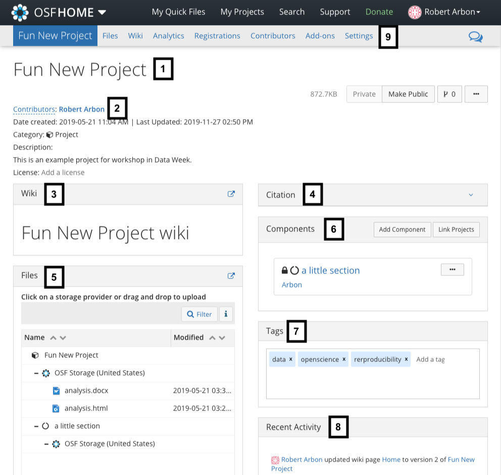
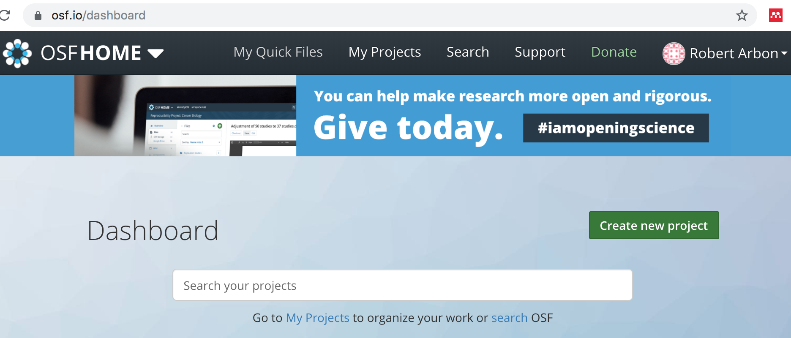
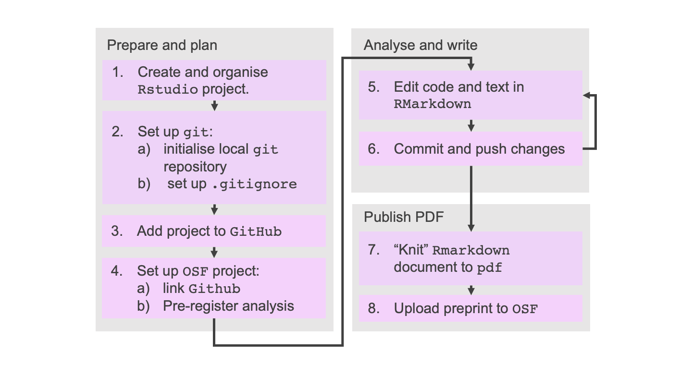

# Introduction
This section will mostly be guided exercises allowing you to piece together everything you have 
learned so far. 

# Open Science Framework
## OSF features
The [Open Science Framework (OSF)](osf.io) is a great tool for sharing your work. 

> ## Sign up to the OSF
> Please go to [osf.io](https://osf.io/) and create an OSF account if you haven't already done so!
{: .challenge}

The key features that make it so useful for the purposes of reproducible workflows are: 

1. **Storage**: it can store an unlimited amount of files, including raw data files, 
accessibly and securely. Even if the Centre for Open Science (the owner of the OSF) go bust, 
they have a fund to maintain the storage. 
2. **Preregistrations**: You can create an analysis plan and pre-register it with the OSF.  
3. **Preprints**: OSF powers and integrates with many different pre-print servers. 
3. **Search functions**: Your profile links to all your projects and there is a search function which 
makes your and other people's research findable. 
3. **Add-ons**: You can link different types of services to an OSF project: 
  * 3rd party storage: You can make a specific folder from Google Drive, Dropbox etc. available to 
  an OSF project, allowing you to share files without any extra work. 
  * References: link a folder from Zotero or Mendeley to share references. 
  * Version control: You can also link Github or Gitlab to a project to share code. 

The supporting documentation is excellent and can be found [here](https://help.osf.io/hc/en-us); 
there is also guides to best practice in open science research practices which can be found 
[here](https://help.osf.io/hc/en-us/categories/360001530634-Best-Practices). 

## OSF Projects
The basic unit of organisation in the OSF Project. Below is a screen shot of a project we have 
called 'Fun New Project'. Each part is described below. 

1. The title of the project. This can be changed at any time. 
2. Metadata for the project: list of contributors, a short description, categorisation, license 
timestamps. 
3. A wiki that can be used to give further description for the project.  
5. A file browser for the project. This will include any linked storage (e.g. Google Drive) or 
Github repository. 
4. A citation for the project in any style you like (from a drop down menu). 
5. A self-contained *component* of the project. Components are just nested projects, i.e. 
they are exactly the same as a project. 
6. Tags for increasing findability. 
8. A public feed of updates to the project. You can subscribe to these if you're a contributor. 
9. Menu bar for extra functionality: 
    1. **Files**: a page dedicated to managing your files. 
    2. **Wiki**: another link to the wiki editing page. 
    3. **Analytics**: see how many times your project has been accessed or your work downloaded. 
    5. **Registrations**:  Make a pre-registration or view an existing pre-registered plan. 
    5. **Contributors**: Manage the contributors to the project. 
    6. **Add-ons**: configure your add-ons and integrations such as Google Drive and Github. 
    7. **Settings**: Miscellaneous settings for the project, e.g. title, email notifications, metadata. 

> ## Create OSF project
> Click on the `Create new project` (see the image below) and create a new project. 
> Call it `ROAR Workshop`.
> 
{: .challenge}

# Work flow
To summarise, our suggested workflow is the following (a detailed explanation is below). Many of 
these steps you should have already done in this workshop. We present it like this so that you have 
a guide for future projects. 

## Steps 1 and 2
From episode 2 you should have already created an RStudio project called `roar_workshop` and 
initialized it as a `git` repository with a `.gitignore` file that ignores standard `R` and `RStudio`
files. If you haven't done this, navigate to 
[episode 2]({{ page.root }}) and follow the instructions there. 

## Step 3
> ## Create directory structure
> Using the `Files` pane in `RStudio` create the following file structure. You should already have
> the `test.R` and `test.Rmd` files from episode 2.  
> ~~~
> roar_workshop\
>    data\
>    output\
>    images\
>    test.R
>    test.Rmd
> ~~~
> {: .source }
{: .challenge}

* The `data` folder should contain the data you'll be using. 
* `output` can be used for any results tables (dataframes), model objects, etc. that you create
* `images` can be used to store copies of images that you might need to keep separate (e.g. for 
publication)

## Step 4 
You should now link the local repository you've created to a new remote repository on Github. To make things easier you can set up SSH access to Github. This isn't necessary but if you do this you won't have to sign in when using Github from your computer.

Thanks to [Happy Git with R](https://happygitwithr.com/) for the instructions. 

> ## Optional: Set up SSH keys
> Follow the instructions on the Github website [here](https://help.github.com/en/enterprise/2.15/user/articles/adding-a-new-ssh-key-to-your-github-account) to set up your SSH key. 
{: .challenge}

> ## Linking local and remote repositories
> 1. Go to https://github.com and make sure you are logged in.
> 2. Click the green `New repository` button. Or, if you are on your own profile page, click on `Repositories`, then click the green “New” button.
> 3. Call the repository 'roar_workshop'
> 4. DO NOT initialize this repository with a README.
> 5. Click the big green button `Create repository.`
> 6. Copy the SSH clone URL to your clipboard via the green `Clone or Download` button. If the link starts with `https` then click the `Use SSH` button in the top right hand corner. 
> 7. Get back to RStudio. 
> 7. Click on the “two purple boxes and a white square” in the Git pane. Click `Add remote`. `Remote Name` should be `origin` (this is the usual name for it); `Remote URL`: paste the url from Github. 
> 8. We should be back in the `New Branch` dialog I assume you’re on the master branch want it to track master on GitHub. Enter master as the branch name and make sure `Sync branch with remote` is checked. Click `Create` (yes, even though the branch already exists). In the next dialog, choose `overwrite`.
{: .challenge}

## Step 5
You should have created an OSF project. If you haven't, do this now (see above exercise). You should 
now link Github the github repo as an add-on: 

> ## Link Github to OSF project
> In the `ROAR Workshop` project select the `Add-ons` menu item. 
> Find the `GitHub` add-on from the list. 
> Click the `Confirm` button after reading the Terms. 
> Navigate to the `Configure Add-ons` box at the bottom and click `Import from Profile`. 
> Link your account by following the instructions
> Find your `raor_workshop` repository and click `Save`. 
{: .challenge}

## Step 6 and 7

> ## Data analysis!
> you should now create an RMarkdown document called `old_faithful.Rmd` and do some exploratory 
> analysis on the `datasets::faithful` dataframe. After you made some changes to this (even just a 
> few lines) `git add ...` and `git commit ...` (with a message!) and then `git push ...`. You should 
> see this changes appear on the Github repository. 
{: .challenge}

Keep adding analysis and adding/committing/pushing. Try and make a story out of the data. An example 
can be found [here](https://gist.github.com/RobertArbon/6789faa0a207648bc09b2aac982f6e0a). 

## Step 8 
When you're happy with your analysis. `knit` it to either `html_document` or a `word_document` by 
adjusting the `output` variable in the front matter and pressing `knit` button. 
You should then upload the html or Word document to the OSF project. 

