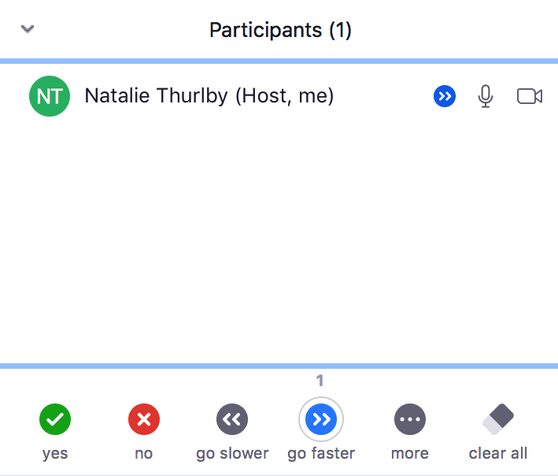

Welcome and house-keeping: ROAR workshop 11/11/2020
=====================================================

## Instructors, organisers, and helpers

 |  | 
Natalie Thurlby - *Instructor*|Robert Arbon - *Instructor*|Jackie Thompson - *Organiser*

<!--TODO: Add others here-->

## Materials

You can find these materials at: [`tinyurl.com/ROAR-website`](http://www.tinyurl.com/ROAR-website)
<!--TODO: Check URL-->

### Setup
Please take a minute to make sure that you have followed the instructions on the [setup](../setup.html) page.

### Code of conduct
<!--TODO: Add a code of conduct page to extras-->
Please take a moment to familiarise yourself with the [code of conduct](https://docs.carpentries.org/topic_folders/policies/code-of-conduct.html) for today. 

## Timings 11/11/2020

|  Time | Description     |
|---|---|
| 9.00 - 9.25 |  Welcome   |
| 9.25 - 9.55  |  Core Concepts in Reproducibility |
| 10.00 - 10.45  |  Tour of RStudio  |
| 11.15 - 12.00  |   RMarkdown  |
| 12.00 - 13.00 |   Lunch   |
| 13.00 - 14.45 |   Version control with Git and GitHub |
| 15.15 - 17.00  |  Putting it all together  |

## Zoom house-keeping

### Mics and cameras
We'd like mics to be off for the majority of the session. There are some discussion exercises, so we will ask you to turn on your mics at those points, and turn them off again afterwards.

### Giving us live feedback
Please use the zoom live-feedback buttons to let us know if we are going too fast or too slow. 

You need to go to the participants tab on zoom, and the feedback buttons are at the bottom. You can see what type of feedback you are currently giving next to your name.

> ## Exercise: rate this joke
> Your instructor will tell you a joke, and you have to react to it.
> > ## Solution
> > `Yes` or `Like`
> {: .solution}
{: .challenge}

#### How to get help
If you have a question, or you need assistance with something, please ask in the chat, as it's likely that everyone could benefit from the answer. 

If the answer is a bit more involved and we can't answer it over the chat, then we'll redirect you to a breakout room, where someone will be able to help you.

### Breakout rooms
We will use breakout rooms for one-to-one help and for small group discussions during exercises.

> ## Exercise: introductions in breakout rooms
> You'll now be assigned to a breakout room. You have 3 minutes (1 minute each) to tell each other:
> * Your name
> * Your research field
> * What you hope to get out of today
{: .challenge}

## Screen-shot
We would like to take a screen shot of the attendees at the beginning of the session, so please turn your camera on if you're able to do so.

---

