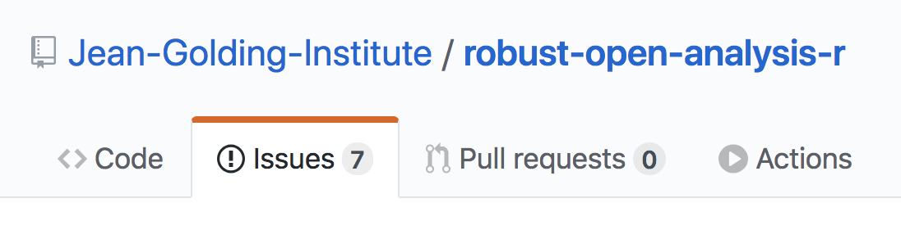
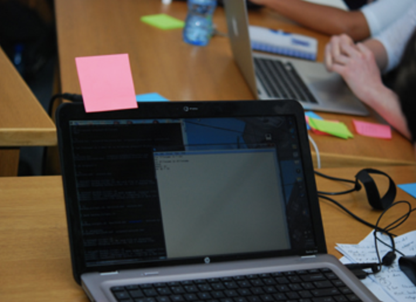

## Where are the materials?
You don't need to write anything down. You can find all our presentations and materials online at [github.com/Jean-Golding-Institute/robust-open-analysis-r](https://github.com/Jean-Golding-Institute/robust-open-analysis-r). 

This tiny URL goes to the same place: [tinyurl.com/uob-roar](http://www.tinyurl.com/uob-roar)

You can also use this GitHub page to make suggestions for edits to this workshop (by opening a GitHub issue - I'll show you how later!):
```{r, echo=F, out.width ='80%',fig.align='left'}

```

--- &twocol

## Code of conduct

We will follow the Software Carpentries code of conduct: https://docs.carpentries.org/topic_folders/policies/code-of-conduct.html

*** =left
Please follow the four social rules:

1.  No feigning surprise 
2.  No "Well-Actuallys"
3.  No Backseat Driving
4.  No subtle "isms"

*** =right

```{r, echo=F, fig.align='left'}

```

---

## Approximate itinerary

* 8:30 - Breakfast
* 9:00 - __Welcome and introductions__
* 9:20 - __Core concepts in reproducibility__
* 10:15 - __Selfish Reasons to work reproducibly__
* 11:00 - Coffee break
* 11:30 - __Getting to grips with RMarkdown__
* 12:30 - Lunch (with a short walk)
* 13:15 - __Version Control using Git, GitHub and RStudio__
* 15:00 - Coffee Break
* 15:00 - __Putting it all together__
* 17:30 - Refreshments and discussion 

--- &twocol

## Post-it notes

Post-it notes tell us how you're feeling (no post-it means you're getting on with something)

*** =left
Pink post-it means you'd like some help or that we're going too fast:
```{r, echo=F, out.width='95%', fig.align='left'}

```

*** =right
Green post-it means you're finished:
```{r, echo=F, out.width='95%', fig.align='left'}
include_graphics('fig/green.png')
```
