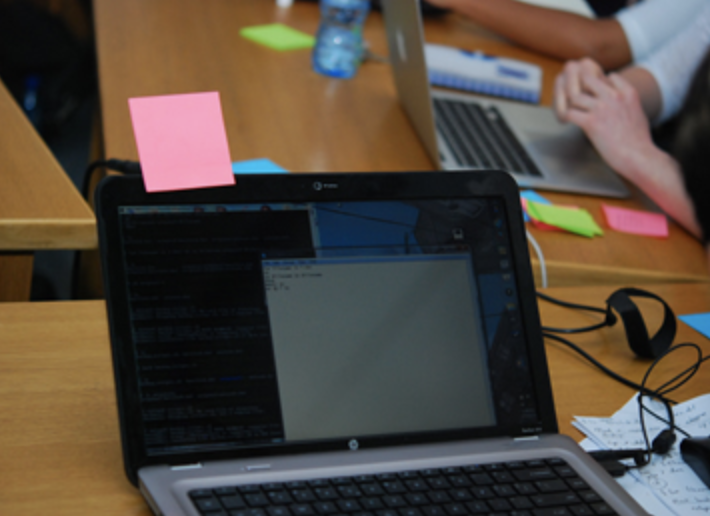
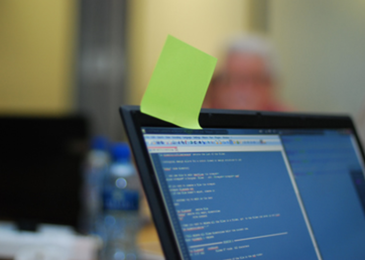
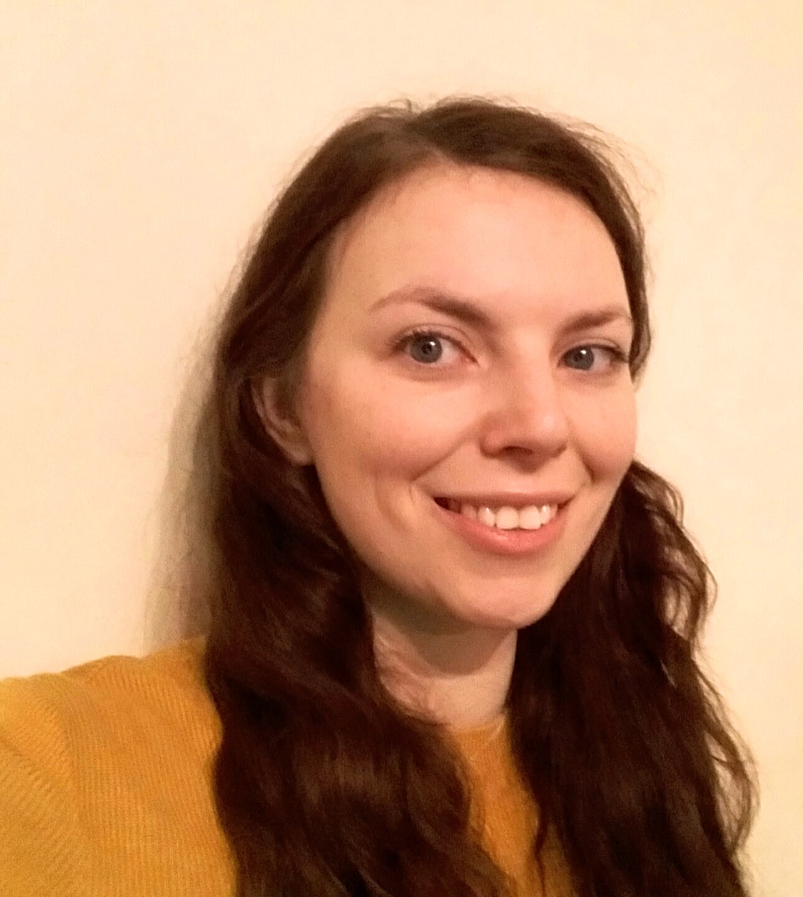
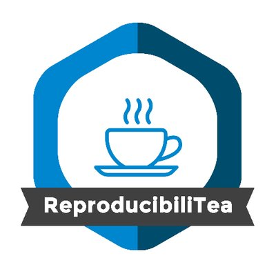

## Why are we here?
- __Aim__: 
    - To make your research easier, more enjoyable, and more reproducible.
    - Be guided through a workflow for open and reproducible research.
- **Delivery**:
    - Short presentations
    - Group discussions (with concept maps)
    - Practicals
- **Outcomes**:
    - Understand the motivations for working reproducibly. 
    - Understand how Rmarkdown can be used to create resources in different formats.
    - Be confident pulling and pushing to GitHub using Git.

---

## Today's approximate itinerary

* 8:30 - Breakfast
* 9:00 - __Welcome, introductions, and setup__
* 9:20 - __Tour of Rstudio__
* 9:40 - __The reproducibility crisis__
* 10:00 - __Selfish Reasons to work reproducibly__
* 10:45 - __Creating our concept map__
* 11:00 - Coffee break
* 11:30 - __Getting to grips with RMarkdown__
* 12:30 - Lunch (with a short walk)
* 13:15 - __Version Control using Git, GitHub and RStudio__
* 15:00 - Coffee Break
* 15:00 - __Putting it all together__
* 17:30 - Refreshments and discussion 

--- 

##  Welcome, introductions, and setup:

* How this course works
  - Where are the materials?
  - Code of conduct
  - Post-it notes
* Introductions
  - Instructors
  - Participants
* Technology setup 

---

## Course materials

You can find all of the course materials at [tinyurl.com/ROAR-workshop](https://tinyurl.com/ROAR-workshop). 

This is a GitHub repository, but the materials are also displayed nicely on the web at [tinyurl.com/ROAR-website](https://tinyurl.com/ROAR-website)

__Bookmark these sites now!__

--- &twocol

## Code of conduct

We will follow the Software Carpentries code of conduct: https://docs.carpentries.org/topic_folders/policies/code-of-conduct.html

*** =left
Please follow the four social rules:

1.  No feigning surprise 
2.  No "Well-Actuallys"
3.  No Backseat Driving
4.  No subtle "isms"

*** =right

```{r, echo=F, fig.align='left'}

```

--- &twocol

## Post-it notes

Post-it notes tell us how you're feeling (no post-it means you're getting on with something)

*** =left
Pink post-it means you'd like some help or that we're going too fast:
```{r, echo=F, out.width='95%', fig.align='left'}

```

*** =right
Green post-it means you're finished:
```{r, echo=F, out.width='95%', fig.align='left'}

```

--- &twocol

## Introductions: Natalie and Rob
Who are we and why do we care about reproducible research?

*** =left
### Natalie Thurlby 
```{r, out.width='40%', echo=F, fig.align='left'}

```
- Data scientist
- Computational biology
- Carpentries instructor
- `@statalieT`

*** =right
### Robert Arbon

```{r,out.width='35%', echo=F, fig.align='left'}

```

* Data scientist
* Computational chemist
* Previously data scientist/economics analyst for dev. agencies (e.g. World Bank)
* `@bertiearbon`

--- 

## Introductions: Your turn!

If you haven't already: Sign up for a GitHub account!

Go to: [hackmd.io/@nataliethurlby/ROAR](https://hackmd.io/@nataliethurlby/ROAR/edit)

Introduce yourself by writing: _Your Name + Your university and department + an emoji that represents your research + an emoji that represents your week._

--- 

## Tech setup

Let's check these three things together:
* Open RStudio
* Check packages installed
* Try to create a new project with version control
* Sign up for the Open Science Framework [osf.io](https://osf.io/)

--- &twocol

## Shout-outs 

*** =left

* __ReproducibiliTea Journal Club__, fortnightly Tuesdays 4pm, grp-ReproducibiliTea or ask Katie, also on twitter at @ReproducibiliT
* __Bristol Reproducibility Network__, grp-Bristol-Reproducibility-Network, @ukrepro
* __Data Week 2020__, 14-20 June 2020, Jean Golding Institute mailing list [bristol.ac.uk/golding/join-our-mailing-list/](bristol.ac.uk/golding/join-our-mailing-list/)
* __ACRC training courses__, ACRC mailing list [bristol.ac.uk/acrc/acrc-training/](http://www.bristol.ac.uk/acrc/acrc-training/)
* Ask-JGI, Ask-RSE and Statistics Clinic

*** =right

```{r, echo=F, fig.align='center',out.width='80%'}

```
