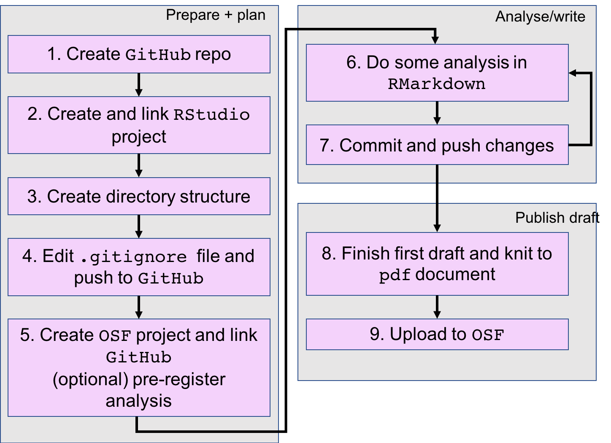

This lesson aims to enable you to do your research analysis reproducibly, at every stage of the process: as you plan/prepare, analyse, and draft/write. 

This will:
- help other people to reproduce your work, and to collaborate with you
- help *you* to reproduce your own work (avoiding moments of terror, e.g. "this code worked before", "what did I do to get that answer"?)
- allow you to create shareable work at each stage of the process (leading to quicker feedback, and a more frequent sense of achievement).

During the lesson, we introduce you to an example reproducible workflow using Git, GitHub, RStudio, and the Open Science Framework. The flowchart below is the workflow that you will complete during the course:

We don't aim to teach you any techniques for doing analysis (i.e. there is no statistics in this course). Instead, we aim to teach you a way to organise your work so that you can do your work with relative ease and efficiency, reducing errors and stress. 

 This is a comment in Liquid 

> ## Prerequisites
>
> This lesson assumes some basic familiarity with R. 
> See the prerequisites section of the [setup](setup.html#prerequisites) page for some recommended tutorials.
{: .prereq}


