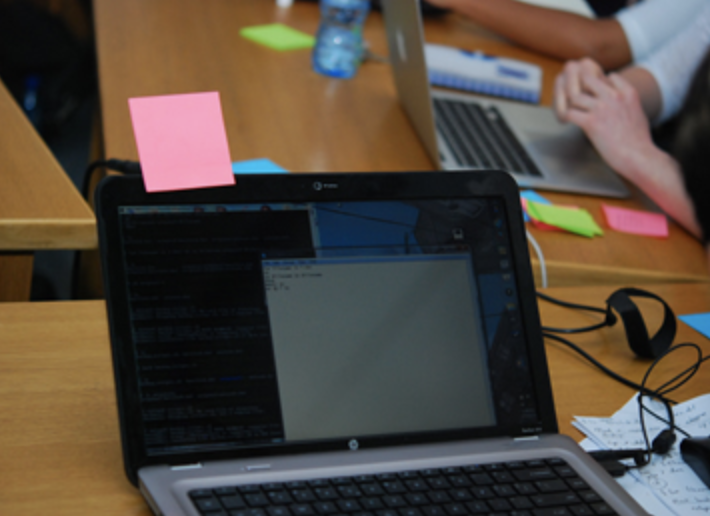
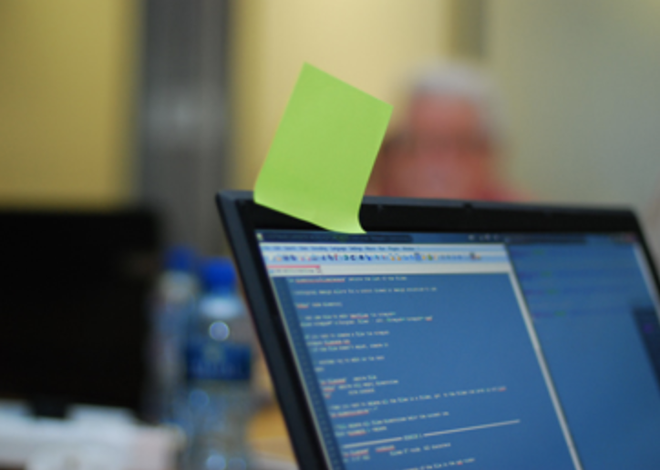

## Approximate itinerary

- 9:00 - Welcome and introductions
- 9:35 - Reproducible research
- 10:45 - Break
- 11:00 - Reproducible research environment 
* 12:00 - Lunch (with a short walk)
* 13:00 - Version control
* 14:45 - Break
* 15:00 - Putting it all together
* 15:30 - Finish 

We're finishing a little early so that we can all attend Rosemary's talk "The African Regional Data Cube" if we want to.

--- &twocol

## Post-it notes

Post-it notes tell us how you're feeling (no post-it means you're getting on with something)

*** =left
Pink post-it means you'd like some help or that we're going too fast:
```{r, echo=F, out.width='95%', fig.align='left'}

```

*** =right
Green post-it means you're finished:
```{r, echo=F, out.width='95%', fig.align='left'}

```
